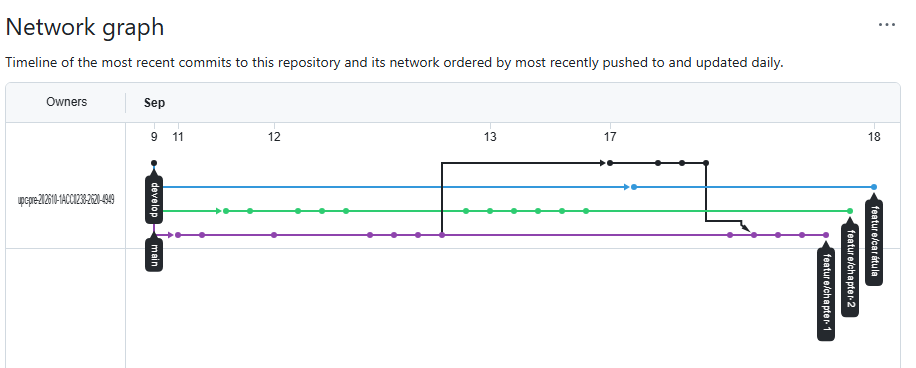

  

  
Universidad Peruana de Ciencias Aplicadas 
  Carrera de Ingeniería de Software

   

  
<strong>1ACC0238</strong> 
  <strong>Aplicaciones para Dispositivos Móviles</strong>

  
NRC 
  <strong>4949</strong>

   

<h3><strong>Informe del Trabajo Final</strong></h3>

   

  
Docente 
  <strong>Quevedo Velasco, David Gerardo</strong>

   

  
Equipo 
  <strong>FireSecure</strong>

   

  
Proyecto 
  <strong>SmartGas</strong>

  

  
<strong>Integrantes</strong>

<table style="margin: 0 auto; border-collapse: collapse;">
  <tr>
    <th style="text-align:left; padding: 2px 20px;">Código</th>
    <th style="text-align:left; padding: 2px 20px;">Apellidos y Nombres</th>
  </tr>
  <tr>
    <td style="padding: 2px 20px;">U202310436</td>
    <td style="padding: 2px 20px;">Espinar Martínez, Gabriel Ferran</td>
  </tr>
  <tr>
    <td style="padding: 2px 20px;">U202318951</td>
    <td style="padding: 2px 20px;">Guevara Serrano, Diego Ismael</td>
  </tr>
  <tr>
    <td style="padding: 2px 20px;">U202210513</td>
    <td style="padding: 2px 20px;">Huaman Olivos, Yeira Shari</td>
  </tr>
  <tr>
    <td style="padding: 2px 20px;">U202221597</td>
    <td style="padding: 2px 20px;">Rioja Nuñez, Franco Diego</td>
  </tr>
  <tr>
    <td style="padding: 2px 20px;">U202414424</td>
    <td style="padding: 2px 20px;">Vivar Cesar, David Ignacio</td>
  </tr>
</table>

  

<strong>Período 202620</strong>

 

<strong>Septiembre 2026</strong>

## Registro de Versiones del Informe

| Version | Fecha      | Autor | Descripcion de Modificacion                                                                                                                   |
|--------|------------|------|-----------------------------------------------------------------------------------------------------------------------------------------------|
| 0.1 | 09/09/2026 | Equipo | Se actualizó el README incorporando el perfil de la solución, antecedentes, problemática, misión, visión y perfiles del equipo.               |
| 0.2 | 10/09/2026 | Equipo | Se desarrolló el Capítulo 1, incluyendo Lean UX Problem Statements, Assumptions, Hypothesis Statements, segmentos objetivos y Lean UX Canvas. |
| 0.3 | 11/09/2026 | Equipo | Se añadieron business assumptions y se consolidó la documentación Lean UX.                                                                    |
| 0.4 | 12/09/2026 | Equipo | Se diseñaron y documentaron las entrevistas.                                                                                                  |
| 0.5 | 13/09/2026 | Equipo | Se añadieron entrevistas de los segmentos objetivo.                                                                                           |
| 0.6 | 14/09/2026 | Equipo | Se incorporaron y corrigieron entrevistas.                                                                                                    |
| 0.7 | 14/09/2026 | Equipo | Se añadieron user personas, needfinding y evidencias.                                                                                         |
| 0.8 | 14/09/2026 | Equipo | Se desarrolló el análisis de entrevistas, Ubiquitous Language y EventStorming.                                                                |
| 0.9 | 14/09/2026 | Equipo | Se añadieron resúmenes de entrevistas y User Journey Mapping.                                                                                 |

## Project Report Collaboration Insights

**Link de la organización:**
https://github.com/upc-pre-202610-1ACC0238-2620-4949

**Link del Repositorio del Informe:** https://github.com/upc-pre-202610-1ACC0238-2620-4949/SmartGas-Report

### Reporte de Colaboración para la Entrega del AV1

## Contributors

  

