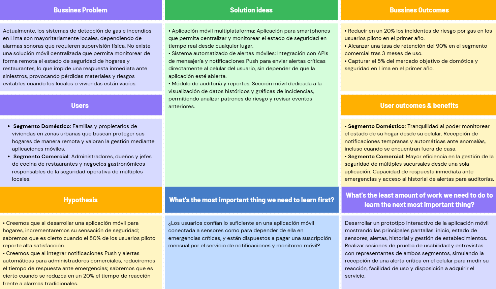

# Capítulo I: Presentación

## 1.1. Startup Profile
### 1.1.1. Descripción de la Startup
Somos **FireSecure**, una startup tecnológica orientada a la ingeniería de software y dedicada a la creación de una aplicacion móvil de monitoreo para la seguridad en infraestructuras residenciales y comerciales. Nuestro trabajo se centra en el desarrollo de arquitecturas orientadas a servicios (SOA) que centralizan y procesan datos de dispositivos IoT en la nube para su consumo en tiempo real desde dispositivos móviles.

Nuestra misión es disminuir el riesgo de desastres por fugas de gas e incendios mediante un producto de software móvil accesible, intuitivo y optimizado para interacciones táctiles. Aspiramos a convertirnos en el ecosistema digital líder en gestión de emergencias, brindando tranquilidad a nuestros usuarios al permitirles visualizar el estado de sus entornos y recibir notificaciones push críticas de manera inmediata directamente en sus smartphones y tablets.

### 1.1.2. Perfiles de integrantes del equipo
| Foto                                                                      | Nombre | Descripción |
|---------------------------------------------------------------------------| --- | --- |
|          | Gabriel Ferran Espinar Martínez (U202310436)| Soy estudiante de la carrera de Ingeniería de Software, Me considero una persona trabajadora. Me interesa aprender constantemente en especial en áreas relacionadas a la tecnología y cuento con conocimientos en HTML, CSS, Javascript y SQL, lo cual puede servir en el desarrollo del proyecto.  |
|                                                                           | Vivar Cesar, David Ignacio (U202414424) |   |
|                                                                           | Rioja Nuñez, Franco Diego (U202221597 )  | 
|  | Huaman Olivos, Yeira Shari (U202210513) |  Estudiante de Ingeniería de Software,  responsable y comprometida, con interés en seguir desarrollando mis habilidades y aportar de manera activa al trabajo en equipo y al desarrollo del proyecto.  |
|                                                                           |Guevara Serrano, Diego Ismael (U202318951) |   |

## 1.2. Solution Profile
### 1.2.1 Antecedentes y problemática
En los últimos años, los incidentes relacionados con fugas de gas e incendios han representado una de las principales causas de pérdidas en los sectores doméstico y gastronómico. Tradicionalmente, los sistemas de prevención se han limitado a hardware analógico o alarmas locales que exigen la presencia física del usuario para ser efectivas.

La problemática central radica en la **ausencia de un monitoreo preventivo remoto y descentralizado**. Los propietarios de viviendas y administradores de cocinas no cuentan con una herramienta digital que procese en tiempo real el estado de sus instalaciones. Esta limitación impide una respuesta inmediata ante anomalías, incrementando exponencialmente el riesgo de desastres al no poder alertar a tiempo a las personas involucradas o a los servicios de emergencia.

Para solucionar este vacío, es imperativo desarrollar una aplicación móvil basada en la nube. Un sistema que no solo consolide la telemetría de los entornos protegidos, sino que provea una interfaz nativa e interactiva, historial estadístico de incidencias y un sistema automatizado de notificaciones push de alta disponibilidad, operando de forma continua en smartphones y tablets como el núcleo de soporte para la toma de decisiones críticas.

### 1.2.2 Lean UX Process.
    
### 1.2.2.1. Lean UX Problem Statements.
**Domain:** El dominio de aplicación de SmartGas se enfoca en el desarrollo de aplicaciones móviles distribuidas aplicadas a la seguridad y monitoreo en entornos culinarios, específicamente en viviendas y restaurantes. En este contexto, la integración de una aplicación móvil con servicios en la nube representa una alternativa innovadora para gestionar y visualizar riesgos asociados al gas y temperatura de forma remota y en tiempo real.

**Customer Segments:** Los segmentos de clientes identificados son: 
* **Hogares:** Familias que buscan proteger sus viviendas mediante el monitoreo remoto de sus cocinas a través de una aplicación móvil accesible desde sus smartphones o tablets.
* **Restaurantes y establecimientos de comida:** Administradores y jefes de cocina responsables de garantizar la seguridad operativa y el cumplimiento de normativas en ambientes de alta demanda. 

**Pain Points:** Dificultad para visualizar en tiempo real el estado de seguridad de la cocina cuando el usuario se encuentra fuera del establecimiento o vivienda. 
* Dependencia de sistemas locales que no ofrecen una interfaz móvil e interactiva para el registro histórico y análisis de datos de incidencias.
* Complejidad en la gestión de múltiples sensores o ubicaciones sin una aplicación centralizada que unifique la información en un dashboard interactivo. 
* Riesgo de pérdidas materiales por la incapacidad de recibir notificaciones de alerta inmediatas en dispositivos móviles a través de la red. 

**Gap:** Existe una brecha tecnológica entre los dispositivos de detección aislados y la necesidad de contar con una solución móvil integral basada en una arquitectura orientada a servicios (SOA). Actualmente, el mercado peruano carece de soluciones SaaS masivas que reúnan accesibilidad económica, una aplicación móvil nativa o híbrida optimizada y una lógica de servidor capaz de automatizar respuestas preventivas y enviar notificaciones push críticas en tiempo real.

**Visión:** La visión de SmartGas es convertirse en el ecosistema móvil líder en seguridad inteligente para cocinas, capaz de centralizar la telemetría de sensores en una aplicación móvil robusta y fluida. El sistema permitirá monitorear riesgos y gestionar respuestas automáticas (notificaciones push instantáneas y control de actuadores) mediante una infraestructura en la nube. La estrategia se centra en la innovación de software, utilizando una arquitectura distribuida para demostrar que la prevención inteligente es gestionable desde la palma de la mano en contextos cotidianos.

**Initial Segment:** Nuestros dos segmentos objetivos definidos son estratégicos porque presentan una alta exposición a riesgos de gas y temperatura, y actualmente carecen de una plataforma web de gestión centralizada. Validar el sistema en estos entornos permite demostrar la eficacia de nuestra aplicación web y su valor preventivo. Por ello nuestra pregunta clave es: ¿Cómo puede una aplicación web distribuida como SmartGas , que integra una API RESTful con servicios de notificación externos, proporcionar una gestión de seguridad eficiente y accesible para disminuir los riesgos de accidentes en cocinas domésticas y comerciales?

### 1.2.2.2. Lean UX Assumptions.
**Assumptions Worksheet**
* **¿Quiénes creemos que serán nuestros usuarios?** 
    * Propietarios de viviendas que utilizan aplicaciones móviles para la domótica y seguridad del hogar. 
    * Gerentes y administradores de locales de comida rápida y restaurantes. 
    * Personal técnico encargado del mantenimiento de seguridad en edificios. 
* **¿Qué creemos que necesitan estos usuarios?** 
    * Monitorear el estado de su seguridad desde una aplicación móvil optimizada e intuitiva.
    * Reducir la incertidumbre mediante la visualización de datos en tiempo real. 
    * Contar con un sistema basado en la nube que actúe rápido y envíe notificaciones push de alerta sin necesidad de intervención manual constante.
    * Acceder a un historial de reportes y eventos de seguridad a través de un panel de control interactivo. 
* **¿Qué espera lograr el proyecto?** 
    * Desarrollar una solución móvil distribuida bajo el modelo SaaS. 
    * Demostrar que la integración de aplicaciones móviles con IoT puede prevenir pérdidas humanas y materiales.
    * Diferenciarse en el mercado mediante un dashboard avanzado de gestión de riesgos. 
* **¿Qué esperamos que pase si la propuesta es válida?** 
    * Alta adopción de la aplicación móvil en el sector gastronómico local y en hogares. 
    * Validación de la arquitectura SOA como una base sólida para la escalabilidad del negocio. 
    * Satisfacción del usuario al interactuar con una interfaz móvil nativa/híbrida, intuitiva y de alta disponibilidad.

**Business Assumptions**
* Posicionar a SmartGas como la aplicación móvil líder en monitoreo de seguridad preventiva.
* Generar confianza en el mercado SaaS mediante un sistema de suscripción confiable y seguro. 
* El mantenimiento de la aplicación móvil y la lógica de servidor no representará un sobrecosto excesivo para el cliente.
* Los usuarios verán en la aplicación móvil SmartGas una herramienta indispensable de uso diario para la continuidad de su negocio y la seguridad de su hogar.

**User Outcome**
* **Cocinas Domésticas (Familias):** 
    * Los usuarios sienten tranquilidad al saber que pueden verificar el estado de su hogar en cualquier momento directamente desde sus smartphones.. 
    * No necesitan ser expertos técnicos; la aplicación móvil ofrece visualizaciones claras y amigables. 
* **Restaurantes (Administradores):** 
    * Una pantalla principal e interfaz móvil que centraliza múltiples locales, permitiendo una gestión operativa rápida y eficiente desde donde se encuentren.
    * Evitan daños en infraestructura costosa gracias a la rapidez de las notificaciones y acciones automáticas del backend. 

**Features**
* **Cocinas Domésticas (Familias):** 
    * Interfaz móvil nativa/híbrida con estados de seguridad en tiempo real y componentes táctiles amigables.
    * Envío de notificaciones push de alta prioridad e integración con servicios de alerta móvil (SMS/Push) directo al dispositivo. 
* **Restaurantes (Administradores):** 
    * Panel de control móvil con gráficas estadísticas interactivas de niveles de gas y temperatura adaptadas a la pantalla del smartphone/tablet.
    * Gestión de usuarios y roles para el personal de seguridad y administración. 
    *API RESTful robusta que asegura la comunicación continua entre los dispositivos IoT y la aplicación móvil.

### 1.2.2.3. Lean UX Hypothesis Statements.
**Business Hypothesis**
Si logramos desarrollar una plataforma web que no solo centralice los datos, sino que además permita gestionar respuestas automáticas y notificaciones remotas a través de una arquitectura SOA en C#, entonces los usuarios percibirán un alto valor preventivo y comercial, lo que se traducirá en una rápida adopción del modelo de suscripción SaaS y una ventaja competitiva frente a sistemas de alarma locales que no ofrecen conectividad web.

**User Hypothesis**
* **Cocinas Domésticas (Familias):** Creemos que las familias necesitan una aplicación móvil de seguridad intuitiva que les permita monitorear su hogar remotamente desde sus smartphones, ya que su prioridad es la protección de sus seres queridos mediante alertas en tiempo real sin lidiar con configuraciones técnicas complejas.
* **Restaurantes (Administradores):** Creemos que los administradores de restaurantes necesitan una aplicación móvil SaaS que automatice la prevención y centralice la información de múltiples zonas en la palma de su mano, ya que su prioridad es asegurar la continuidad del negocio y proteger sus activos mediante notificaciones instantáneas y decisiones basadas en datos en tiempo real desde cualquier lugar.
### 1.2.2.4. Lean UX Canvas.

## 1.3. Segmentos objetivo
**Segmento Doméstico: Familias y Propietarios de Viviendas**
Este segmento está compuesto por familias o individuos que residen en hogares urbanos y buscan proteger sus viviendas de accidentes relacionados con el uso de gas y riesgos eléctricos.

* **Perfil y Comportamiento:** Usuarios familiarizados con el uso de aplicaciones móviles cotidianas, pero que no necesariamente poseen conocimientos técnicos avanzados en redes o infraestructura.
* **Necesidad Tecnológica:** Requieren una app móvil intuitiva y responsiva que les permita visualizar el estado de seguridad de sus cocinas en tiempo real. Su prioridad es recibir notificaciones push de alerta tempranas directamente en sus dispositivos, permitiéndoles tomar acción inmediata sin necesidad de supervisión presencial constante.

**Segmento Comercial: Administradores y Chefs de Restaurantes**
Este segmento abarca a dueños de negocios, administradores y jefes de cocina responsables de garantizar la seguridad operativa en establecimientos de comida, restaurantes y ambientes de alta demanda.

* **Perfil y Comportamiento:** Profesionales enfocados en la continuidad del negocio, la protección de su personal y el cumplimiento de estándares de seguridad. Manejan operaciones críticas y necesitan herramientas de gestión unificadas.
* **Necesidad Tecnológica:** Requieren un panel de control móvil avanzado soportado por una arquitectura orientada a servicios (SOA). Necesitan visualizar datos históricos de sensores, gestionar múltiples zonas de la cocina y confiar en una lógica de lado servidor robusta que no solo notifique las emergencias, sino que centralice la automatización de acciones preventivas para evitar la paralización de sus operaciones comerciales.
