# Capítulo II: Requirements Development and Software Solution Design

## 2.1. Competidores

### 2.1.1. Análisis competitivo

| Características           | Google Nest Protect                                     | Kidde                                                | Tyco SimplexGrinnell                                      | SmartGas                                                                                          |
|:--------------------------|:--------------------------------------------------------|:-----------------------------------------------------|:----------------------------------------------------------|:--------------------------------------------------------------------------------------------------|
| **Perfil del Competidor** | Ecosistema inteligente cerrado de alta gama.            | Líder en alarmas locales de bajo costo.              | Sistema industrial corporativo especializado.             | **Plataforma SaaS de monitoreo preventivo con arquitectura orientada a servicios (SOA).**         |
| **Mercado Objetivo**      | Hogares con alta conectividad y presupuesto.            | Familias y pequeños comercios locales.               | Grandes corporaciones y sector industrial.                | Hogares urbanos y restaurantes en Perú.                                                           |
| **Ventaja Competitiva**   | Integración total con Google Home y smartphones.        | Reconocimiento de marca y bajo costo de adquisición. | Alta robustez y certificaciones de seguridad industrial.  | **Monitoreo remoto vía App Móvil (nativa/multiplataforma) y notificaciones push en tiempo real.** |
| **Fortalezas**            | Ecosistema digital sólido y actualizaciones constantes. | Disponibilidad masiva y sin pagos de suscripción.    | Soluciones integrales para entornos de alta complejidad.  | **Arquitectura SOA escalable, Backend en C# y una app móvil de alta usabilidad.**                 |
| **Debilidades**           | Dependencia de hardware propietario y costo elevado.    | Carece de conectividad remota y gestión de datos.    | Instalaciones complejas e interfaces de usuario cerradas. | Marca nueva en el mercado con necesidad de validación inicial.                                    |

### 2.1.2. Estrategias y tácticas frente a competidores

**Fortalezas: Enfoque especializado en monitoreo preventivo y arquitectura SOA**
La startup FireSecure se diferencia de competidores como Google Nest Protect y Tyco al desarrollar SmartGas, una app móvil que no depende de ecosistemas cerrados. A diferencia de Kidde, que ofrece hardware analógico, SmartGas utiliza una arquitectura orientada a servicios (SOA) en C# que permite el procesamiento de telemetría en la nube, visualización móvil nativa/multiplataforma y un sistema de alertas proactivo.

**Táctica:**
Posicionar a SmartGas en el mercado como la solución que democratiza la seguridad inteligente, permitiendo a los usuarios monitorear sus instalaciones desde su smartphone sin la complejidad de sistemas industriales ni el costo de hardware de gama alta.

**Debilidades: Startup en etapa temprana con necesidad de validación**
Al ser una empresa nueva, FireSecure no cuenta aún con la trayectoria de marca de Google ni las certificaciones masivas de Tyco. Esto puede generar dudas en el segmento comercial (restaurantes) respecto a la fiabilidad a largo plazo de la plataforma SmartGas.

**Táctica:**
Ejecutar programas piloto de SmartGas en restaurantes locales de Lima (como en Jesús María) para recolectar métricas de desempeño y testimonios. Estos casos de éxito servirán como validación técnica para demostrar la robustez del backend y de la app móvil frente a situaciones reales.

**Oportunidades: Necesidad de digitalización en el sector residencial y culinario peruano**
Existe un vacío en el mercado local donde los sistemas de seguridad son locales o muy costosos. SmartGas tiene la oportunidad de capturar este nicho ofreciendo una solución que se integra con dispositivos IoT accesibles, algo que los competidores internacionales no han adaptado al contexto económico del Perú.

**Táctica:**
Enfocar los esfuerzos de marketing de FireSecure en la "Prevención Basada en Datos", ofreciendo no solo la alarma, sino el historial de eventos y reportes estadísticos de SmartGas para que los administradores de restaurantes puedan tomar decisiones informadas sobre sus operaciones desde la app móvil.

**Amenazas: Competidores con mayores recursos y capacidad de réplica**
Empresas consolidadas podrían intentar lanzar versiones simplificadas de sus productos si perciben el crecimiento de FireSecure. Además, el ingreso de soluciones genéricas de bajo costo podría presionar los precios de suscripción de SmartGas.

**Táctica:**
Mantener una ventaja competitiva a través de la innovación ágil en el software. FireSecure debe aprovechar su arquitectura SOA para integrar rápidamente nuevas funcionalidades en SmartGas basadas en el feedback de los usuarios locales y ofrecer un soporte técnico en español directo y especializado, algo que Google o Kidde no priorizan en la región.

## 2.2. Entrevistas.

### 2.2.1. Diseño de entrevistas

**Segmento Objetivo 1: Familias y Propietarios de Viviendas**

1. ¿Cuál es su nombre, edad y a qué se dedica actualmente?
2. ¿En qué distrito vive y con cuántas personas comparte su hogar?
3. ¿Qué tipo de dispositivos utiliza con mayor frecuencia (celular, laptop, tablet)?
4. ¿Qué aplicaciones o páginas usa en su día a día?
5. ¿Qué tan familiarizado está con el uso de aplicaciones o dispositivos inteligentes en el hogar?
6. En su vivienda, ¿qué tipo de cocina utiliza (gas, eléctrica, mixta)?
7. ¿Ha tenido alguna experiencia o conoce casos cercanos de fugas de gas o incendios domésticos?
8. ¿Qué medidas de seguridad tiene actualmente en su hogar para prevenir estos riesgos?
9. ¿Con qué frecuencia revisa el estado de su cocina o instalaciones de gas?
10. ¿Qué tan seguro se siente respecto a posibles fugas de gas cuando no está en casa?
11. Si ocurriera una fuga de gas mientras usted no está presente, ¿cómo se enteraría?
12. ¿Qué dificultades encuentra al depender solo de revisiones manuales o alarmas tradicionales?
13. ¿Le gustaría poder monitorear el estado de su hogar en tiempo real desde su celular o navegador?
14. ¿Qué funcionalidades le parecerían más útiles en una plataforma de seguridad doméstica (alertas, historial, visualización en tiempo real, etc.)?
15. ¿Estaría dispuesto a usar una aplicación como SmartGas que le envíe alertas automáticas ante riesgos? ¿Por qué?

**Segmento Objetivo 2: Administradores y Chefs de Restaurantes**

1. ¿Cuál es su nombre, edad y cuál es su rol dentro del restaurante o negocio?
2. ¿En qué distrito se encuentra su local y cuánto tiempo lleva operando?
3. ¿Qué dispositivos utiliza para gestionar su negocio (PC, laptop, celular, tablet)?
4. ¿Qué sistemas o herramientas digitales utiliza actualmente en la gestión del restaurante?
5. ¿Qué tan importante considera la tecnología en la seguridad y operación de su negocio?
6. ¿Qué tipo de equipos de cocina utilizan y qué tan dependientes son del gas?
7. ¿Ha experimentado o conoce incidentes relacionados con fugas de gas o incendios en restaurantes?
8. ¿Qué protocolos de seguridad tiene implementados actualmente en su cocina?
9. ¿Cómo supervisa el estado de las instalaciones de gas y temperatura en su local?
10. ¿Qué dificultades enfrenta al monitorear la seguridad en tiempo real, especialmente en horas de alta demanda?
11. ¿Qué consecuencias tendría para su negocio una fuga de gas o un incendio?
12. ¿Qué tan complicado es llevar un registro o historial de incidentes de seguridad actualmente?
13. ¿Le resultaría útil contar con un sistema centralizado que monitoree múltiples áreas o locales en tiempo real?
14. ¿Qué funciones considera indispensables en una plataforma de monitoreo (alertas automáticas, reportes, control por zonas, etc.)?
15. ¿Estaría dispuesto a implementar una solución como SmartGas para mejorar la seguridad de su negocio? ¿Por qué?

### 2.2.2. Registro de entrevistas

##### Segmento objetivo #1 Familias y Propietarios de Viviendas

#### Entrevista 1:

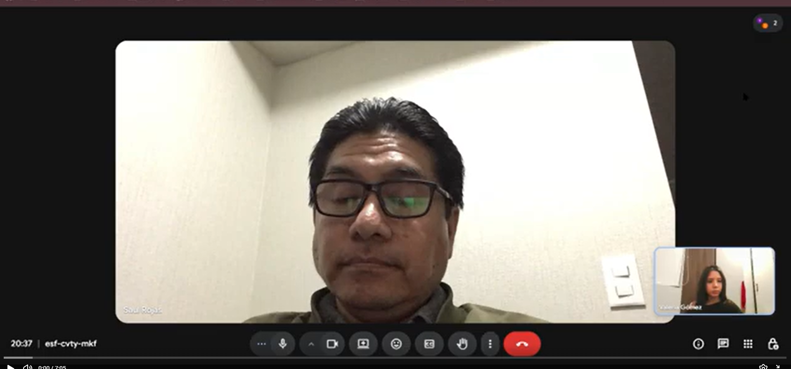

- **Nombres y apellidos:** Saúl Romani
- **Edad:** 48
- **Distrito:** Jesús María
- **Inicio:** 0:18
- **Duración:** 7:05
- **URL:**  [entrevista](https://youtu.be/n1bmq2q0aiQ)
- **Resumen:** Saúl, de 48 años, es ingeniero de sistemas de la información y reside en un departamento con servicio de seguridad en el distrito de Jesús María. A pesar de contar con medidas de protección en su vivienda, menciona que uno de sus mayores gastos está relacionado con el mantenimiento, especialmente en aspectos vinculados a la seguridad y el buen funcionamiento del hogar. Sin embargo, señala que aún no confía completamente en los sistemas tradicionales, ya que considera que no siempre previenen incidentes de manera oportuna. Frente a ello, indica que sí usaría una aplicación como Smart Guard, porque le brindaría mayor tranquilidad y control. Para él, las funcionalidades más útiles serían el monitoreo de los niveles de gas mediante sensores y la detección de movimiento, ya que estas permitirían identificar riesgos a tiempo y actuar rápidamente ante posibles emergencias en la cocina.

#### Entrevista 2:

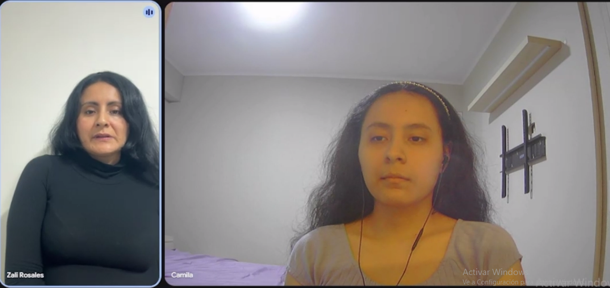

- **Nombres y apellidos:** Sheila Rosales
- **Edad:** 42
- **Distrito:** Trujillo
- **Inicio:** 0:00
- **Duración:** 7:11
- **URL:**  [entrevista](https://youtu.be/VHuMHrjeVto)
- **Resumen:** Sheila, de 42 años, se dedica al hogar y reside en el distrito de Trujillo junto a su familia en una vivienda de tres personas. Aunque utiliza dispositivos tecnológicos como celular y laptop diariamente, no cuenta con sistemas inteligentes en casa, aunque reconoce su utilidad para prevenir accidentes. Utiliza una cocina a gas y, aunque no ha sufrido incidentes personales, manifiesta una gran preocupación por la posibilidad de fugas o incendios cuando no se encuentra presente, dependiendo actualmente solo de la vigilancia visual de los vecinos para enterarse de una emergencia.   Menciona que su única medida de seguridad actual es la revisión manual, pero admite que no realiza mantenimientos frecuentes. Frente a esta situación, Sheila muestra un alto interés en utilizar SmartGas, destacando que le brindaría la tranquilidad de monitorear su hogar en tiempo real. Para ella, las funcionalidades más valiosas serían las alertas automáticas y la visualización en tiempo real, ya que le permitirían actuar con rapidez o enviar ayuda antes de que ocurra un accidente grave, transformando su actual incertidumbre en un control preventivo directo desde su celular.

#### Entrevista 3:

- **Nombres y apellidos:** Sonia Rojas
- **Edad:** 57
- **Distrito:** Cercado de Lima
- **Inicio:** 0:00
- **Duración:** 5:41
- **URL:**  [entrevista](https://upcedupe-my.sharepoint.com/:v:/g/personal/u20241d995_upc_edu_pe/IQBheKhR4PPTRKlTRUd6PQNKAdXT_fgaZvI961KIImPMP3w?e=k0RXJx&nav=eyJyZWZlcnJhbEluZm8iOnsicmVmZXJyYWxBcHAiOiJTdHJlYW1XZWJBcHAiLCJyZWZlcnJhbFZpZXciOiJTaGFyZURpYWxvZy1MaW5rIiwicmVmZXJyYWxBcHBQbGF0Zm9ybSI6IldlYiIsInJlZmVycmFsTW9kZSI6InZpZXcifX0%3D)
- **Resumen:** Sonia, de 57 años, es una ama de casa del distrito de Cercado de Lima la cual vive en su hogar junto con sus 2 hijos. Si bien ella utiliza dispositivos electronicos tales como su celular, ella no está acostumbrada a usar equipos de escritorio como laptops o computadoras, así como tampoco está familiarizada con el uso de sistemas inteligente en su hogar, pese a ello reconoce que estos sistemas pueden ser de gran utilidad para la detección de incidente en el hogar. Utiliza una cocina a gas, no he sufrido ningun accidente relaciona con gas o fuego sin embargo conocidos suyos si han sufrido de está clase de incidentes. Ella muestra preocupación por el bienestar de su familia en caso uno de estos incidente se pueda sucitar. Sonia muestra interes en la aplicación de SmartGuard, resalta que la funcionalidad de las notificaciones y alertas automáticas le parecen las más importantes pues le permitirian saber cuando es que su familia sufre de algún riesgo.

##### Segmento objetivo #2 Administradores y Chefs de Restaurantes

#### Entrevista 1:

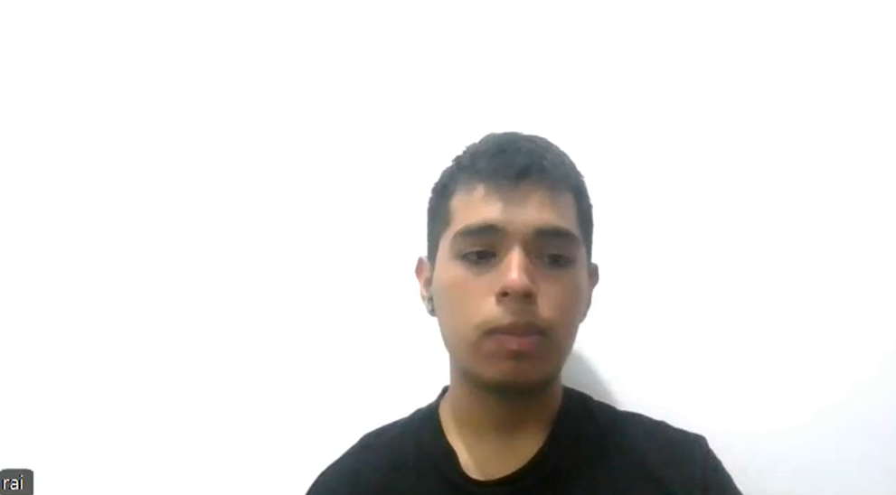

- **Nombres y apellidos:** Raí Beizaga
- **Edad:** 20
- **Distrito:** Jesús María
- **Inicio:** 0:00
- **Duración:** 4:46
- **URL:**  [entrevista](https://upcedupe-my.sharepoint.com/:v:/g/personal/u202310436_upc_edu_pe/IQCEZTjEZ0mgTrHjCdh71j0DAS2Z7AX7h5JkZvyN8dp-oaI?nav=eyJyZWZlcnJhbEluZm8iOnsicmVmZXJyYWxBcHAiOiJPbmVEcml2ZUZvckJ1c2luZXNzIiwicmVmZXJyYWxBcHBQbGF0Zm9ybSI6IldlYiIsInJlZmVycmFsTW9kZSI6InZpZXciLCJyZWZlcnJhbFZpZXciOiJNeUZpbGVzTGlua0NvcHkifX0&e=C5xNxe)
- **Resumen:** Raí, de 20 años, se desempeña como ayudante de cocina el restaurante Terminal Pesquero ubicado en Jesús María, el cual lleva trabajando desde hace 5 meses. Debido a la naturaleza de su trabajo, opera constantemente equipos de alto riesgo como freidoras, hornos y cocinas industriales que dependen totalmente del suministro de gas. Actualmente, la seguridad del local se gestiona de forma manual, realizando inspecciones visuales de válvulas y conexiones antes de iniciar la jornada, lo que resulta insuficiente durante las horas de alta demanda donde el control se pierde. Fabrizio señala que una fuga de gas o un incendio no solo representaría una pérdida económica devastadora, sino un daño irreparable a la reputación del negocio. Como trabajador joven, manifiesta una mayor confianza en la precisión de los sensores tecnológicos que en el olfato humano para detectar peligros. Ante este contexto, considera que SmartGas sería una solución indispensable, destacando funciones como las alertas inmediatas al celular, gráficos de temperatura para evitar sobrecalentamientos y un botón de corte de emergencia para aviso rápido a mantenimiento o bomberos

#### Entrevista 2:

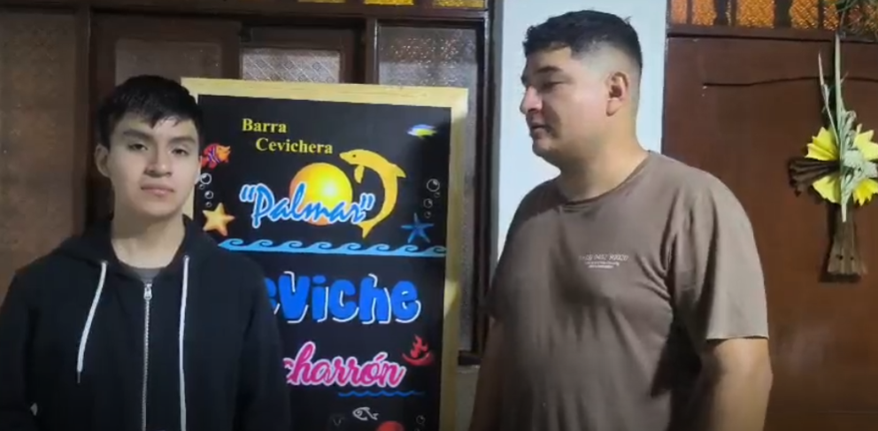

- **Nombres y apellidos:** Kevin Arnold Izquiero Pardave
- **Edad:** 31
- **Distrito:** Jesús María
- **Inicio:** 0:00
- **Duración:** 4:17
- **URL:**  [entrevista](https://upcedupe-my.sharepoint.com/:v:/g/personal/u20241d995_upc_edu_pe/IQBTiLZJ_3yESbU6W2h2tA0SATm3CL-mSGMoO3EUsrkm_ak?e=ONsG8Y&nav=eyJyZWZlcnJhbEluZm8iOnsicmVmZXJyYWxBcHAiOiJTdHJlYW1XZWJBcHAiLCJyZWZlcnJhbFZpZXciOiJTaGFyZURpYWxvZy1MaW5rIiwicmVmZXJyYWxBcHBQbGF0Zm9ybSI6IldlYiIsInJlZmVycmFsTW9kZSI6InZpZXcifX0%3D)

- **Resumen:** Resumen: Kevin, 31 años, es el dueño de un restaurante y administrador del restaurante Palmar, ubicado en Comas. Este restaurante lleva existiendo por más de 20 años, y él actualmente está a cargo del local, relevando a su padre. Si bien es el administrador, también ayuda en las labores de cocina cuando es necesario, por lo que está en contacto con dispositivos como estufas, freidoras e incluso hornos, los cuales funcionan, por supuesto, a base de gas.

  En la actualidad, los métodos de prevención que poseen en caso de incendio o fuga de gas son completamente manuales, ya que dependen de inspeccionar visualmente que no haya ninguna fuga. Kevin indica que, si bien no ha experimentado de primera mano un accidente como el descrito, sí ha escuchado de locales en los cuales esto ha ocurrido, y reconoce el peligro que significa que uno de estos incidentes escale, ya que implicaría perder toda su inversión, además de poner en riesgo a su personal.

  Como administrador del local, opina que se sentiría más seguro si hubiera un sistema que lo alerte de estos incidentes de forma temprana, para evitar pérdidas tanto monetarias como humanas. Considera que SmartGas sería una solución eficiente para dichos incidentes, al notificar a su personal y contar con medidas preventivas para evitar que el problema escale.

#### Entrevista 3:

- **Nombres y apellidos:** Ruben Isaias Carhuaz Pomachagua
- **Edad:** 49
- **Distrito:** Lince
- **Inicio:** 0:00
- **Duración:** 4:12
- **URL:**  [entrevista](https://upcedupe-my.sharepoint.com/:v:/g/personal/u20241d932_upc_edu_pe/IQAtlT93b6nWS5YXY5ZMGrNaAefLFvGOWZS-ZqiV_Y2y53w?nav=eyJyZWZlcnJhbEluZm8iOnsicmVmZXJyYWxBcHAiOiJPbmVEcml2ZUZvckJ1c2luZXNzIiwicmVmZXJyYWxBcHBQbGF0Zm9ybSI6IldlYiIsInJlZmVycmFsTW9kZSI6InZpZXciLCJyZWZlcnJhbFZpZXciOiJNeUZpbGVzTGlua0NvcHkifX0&e=u8AERl)

- **Resumen:** Resumen: Rubén Carhuaz, de 49 años y gerente de un restaurante con dos años de funcionamiento, reconoce que la tecnología es un recurso indispensable para la seguridad, especialmente porque su operación depende totalmente del gas. Actualmente, sus métodos de prevención son rudimentarios y se limitan a la revisión manual de mangueras, lo que representa un riesgo latente, ya que un incendio o fuga significaría "perderlo todo". Ante este panorama, Rubén se muestra dispuesto a implementar una solución tecnológica que centralice el monitoreo y, sobre todo, emita alertas inmediatas para garantizar la protección de sus trabajadores y clientes.

### 2.2.3. Análisis de entrevistas

**Segmento 1: Familias y Propietarios de Viviendas**

* **Perfil y Residencia:** 100% reside en zonas urbanas en hogares con 3 o más personas.

* **Equipamiento del Hogar:** 100% utiliza cocinas a gas y cuenta con dispositivos como celulares y laptops.

* **Seguridad Actual:** 100% depende exclusivamente de métodos manuales (revisión visual y olfato) o de la vigilancia de terceros (vecinos).

* **Problemas y Preocupaciones:**

    * 100% manifiesta preocupación o desconfianza ante posibles fugas de gas cuando no están en casa.

    * 50% señala que los sistemas tradicionales no previenen incidentes de forma oportuna.

    * 50% admite que no realiza mantenimientos preventivos con frecuencia.

* **Funciones Valoradas:** 100% prioriza el monitoreo en tiempo real y las alertas automáticas al celular. El 50% también valora la detección de movimiento.

* **Adopción de SmartGas:** 100% está dispuesto a utilizar la aplicación porque les brinda tranquilidad, control y una respuesta rápida ante emergencias.

**Segmento 2: Administradores y Chefs de Restaurantes**

* **Rol y Experiencia:** 100% opera directamente equipos de alto riesgo que dependen del gas.

* **Gestión de Seguridad:** 100% gestiona la seguridad de forma manual mediante inspecciones visuales de mangueras y válvulas.

* **Riesgos Identificados:**

    * 100% afirma que una fuga o incendio significaría "perderlo todo" (inversión y activos).

    * 66% señala que el factor humano es insuficiente durante horas de alta demanda o para detectar peligros invisibles al olfato.

    * 33% destaca el riesgo irreparable a la reputación del negocio.

* **Tecnología y Confianza:** 100% considera la tecnología como un recurso indispensable y confía más en la precisión de los sensores que en el control manual.

* **Funciones Deseadas en SmartGas:** 100% solicita alertas inmediatas al celular. El 66% valora medidas preventivas automáticas y el 33% requiere gráficos de temperatura.

* **Adopción de SmartGas:** 100% considera la solución como una herramienta eficiente e indispensable para centralizar el monitoreo y proteger a sus trabajadores y clientes.

## 2.3. Needfinding

### 2.3.1. User Personas

En esta sección se presentan los User Personas que representan a los principales segmentos objetivo del proyecto. Estos perfiles han sido construidos a partir de las características, necesidades y comportamientos identificados durante el análisis previo.

Cada persona refleja un tipo de usuario real, permitiendo comprender mejor sus objetivos, motivaciones y dificultades en relación con la seguridad en entornos donde se utiliza gas

**Segmento Objetivo 1: Familias y Propietarios de Viviendas**

*Figura 2 (User Persona 1)*
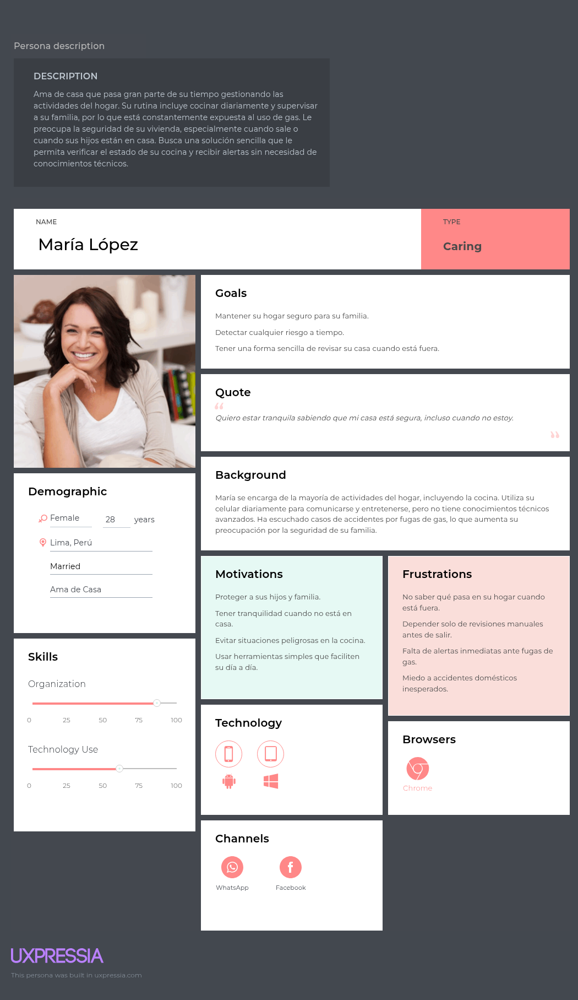

**Segmento Objetivo 2: Administradores y Chefs de Restaurantes**

*Figura 3 (User Persona 2)*
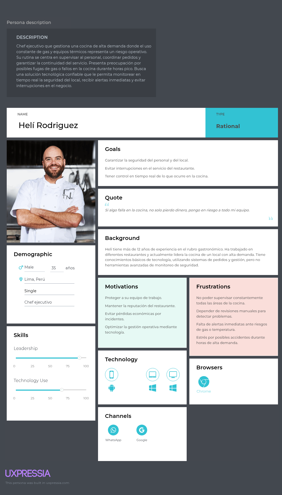

### 2.3.2. User Task Matrix

En esta sección se identifican las principales actividades que realizan los usuarios en su día a día para mantener la seguridad en sus entornos, tanto en el hogar como en espacios de trabajo.

Estas tareas reflejan cómo gestionan actualmente los riesgos asociados al uso de gas, sin el apoyo de una solución digital como SmartGas.

| Tareas / User Persona                                | Helí Rodríguez (Frec.) | Helí Rodríguez (Imp.) | María López (Frec.) | María López (Imp.) |
| ---------------------------------------------------- | ---------------------- | --------------------- | ------------------- | ------------------ |
| Supervisar equipos de cocina                         | Alta                   | Alta                  | Media               | Alta               |
| Revisar instalaciones de gas                         | Media                  | Alta                  | Baja                | Alta               |
| Detectar olores o señales de fuga                    | Media                  | Alta                  | Baja                | Alta               |
| Verificar que todo esté apagado                      | Alta                   | Alta                  | Alta                | Alta               |
| Actuar ante emergencias                              | Baja                   | Alta                  | Baja                | Alta               |
| Realizar mantenimiento preventivo                    | Media                  | Alta                  | Baja                | Media              |
| Depender de revisiones manuales                      | Alta                   | Alta                  | Alta                | Alta               |
| Usar el celular para comunicarse                     | Alta                   | Media                 | Alta                | Media              |
| Preocuparse por la seguridad cuando no está presente | Alta                   | Alta                  | Alta                | Alta               |

Se observa que ambos usuarios dependen en gran medida de revisiones manuales para garantizar la seguridad, lo que puede generar descuidos o respuestas tardías ante un problema.

Helí tiene una carga operativa más alta y necesita control constante en un entorno exigente, mientras que María busca principalmente tranquilidad y prevención en su hogar.

Esto refuerza la necesidad de una solución que permita monitoreo remoto y alertas oportunas, adaptándose tanto a un uso profesional como doméstico.

### 2.3.3. User Journey Mapping

En esta sección se describe el recorrido que siguen los usuarios en su interacción con una posible solución al problema identificado. A través de distintas etapas, se analiza cómo evolucionan sus objetivos, acciones, percepciones y dificultades desde el momento en que toman conciencia del riesgo hasta que adoptan una herramienta que les permita gestionarlo.

El User Journey permite identificar puntos críticos y oportunidades de mejora, facilitando el diseño de una experiencia que responda de manera efectiva a las necesidades de cada segmento.

**Segmento Objetivo 1: Familias y Propietarios de Viviendas**

*Figura 4 (User Journey Mapping 1)*
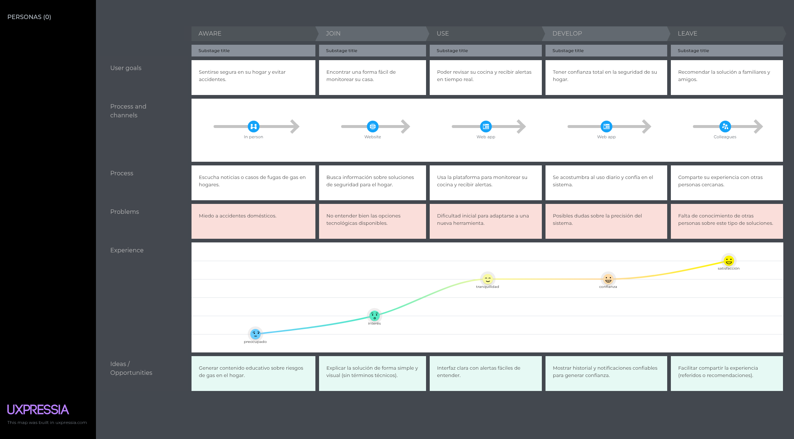

**Segmento Objetivo 2: Administradores y Chefs de Restaurantes**

*Figura 5 (User Journey Mapping 2)*
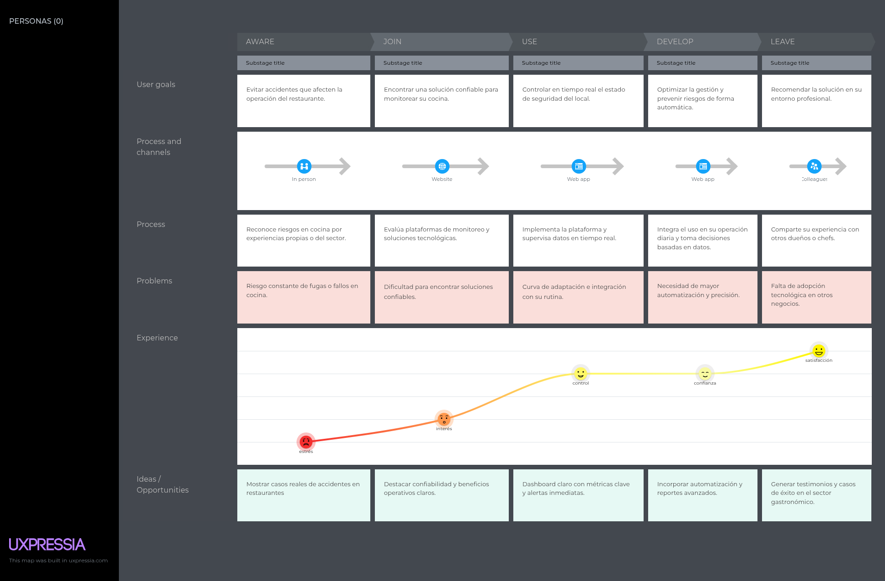

### 2.3.4. Empathy Mapping

En esta sección se analizan los pensamientos, emociones, acciones y percepciones de los usuarios con el objetivo de comprender mejor su comportamiento frente al problema planteado.

El Empathy Map permite profundizar en las necesidades reales de cada segmento, identificando sus preocupaciones, motivaciones y frustraciones. Esto contribuye a diseñar una solución más alineada con el usuario, asegurando que la propuesta de valor sea clara, útil y relevante en su contexto.

**Segmento Objetivo 1: Familias y Propietarios de Viviendas**

*Figura 6 (Empathy Map 1)*
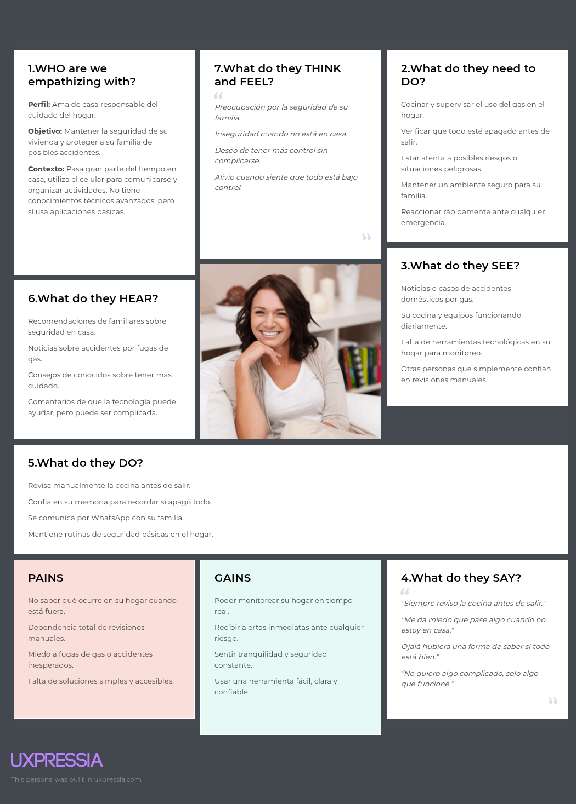

**Segmento Objetivo 2: Administradores y Chefs de Restaurantes**

*Figura 7 (Empathy Map 2)*
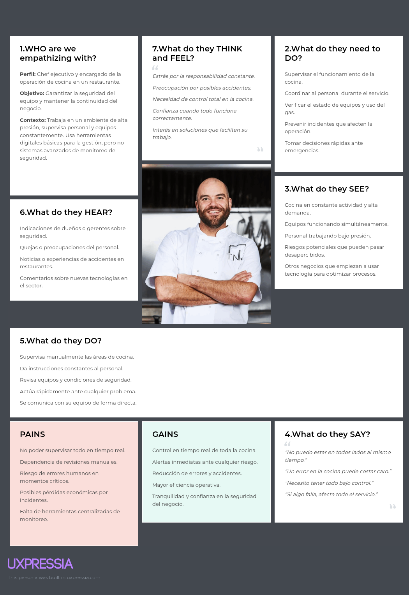

### 2.3.5. Big Picture EventStorming

*Figura 8 (BigPicture Event Storming)*

  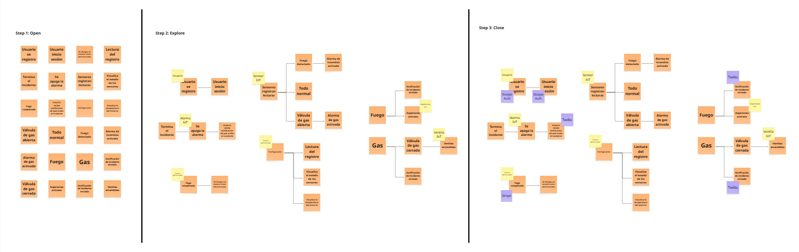

### 2.3.6. Ubiquitous Language

En este apartado se definen los términos clave que se utilizarán a lo largo del desarrollo del sistema SmartGas. Este conjunto de conceptos permite que tanto el equipo técnico como los usuarios tengan una misma interpretación de los elementos y procesos del sistema.

El uso de este lenguaje común facilita la comprensión del funcionamiento de la plataforma, reduce confusiones y asegura coherencia en el diseño e implementación de la solución.

A continuación, se presentan los principales términos definidos:

* Telemetría de sensores en tiempo real: Datos continuos enviados por sensores de gas y temperatura hacia el sistema para su monitoreo.

* Sensor IoT: Dispositivo físico instalado en cocinas o ambientes que mide niveles de gas y temperatura.

* Anomalía de gas o temperatura: Valor detectado fuera de los rangos seguros establecidos que puede representar un riesgo.

* Detección de fuga de gas: Identificación automática de niveles peligrosos de gas en el ambiente.

* Alerta de seguridad: Notificación generada por el sistema cuando se detecta una anomalía.

* Notificación en tiempo real: Mensaje enviado al usuario o servicios externos de forma inmediata.

* Dashboard de monitoreo: Interfaz móvil donde el usuario visualiza el estado de sus sensores y niveles de seguridad.

* Historial de incidencias: Registro almacenado de eventos relacionados con anomalías o alertas detectadas.

* Monitoreo remoto: Capacidad de supervisar el estado del entorno desde cualquier dispositivo con acceso a internet.

* Gestión de dispositivos: Proceso de registrar, configurar y asociar sensores a usuarios o ubicaciones.

## 2.4. Requirements specification

### 2.4.1. User Stories

En esta sección se presentan las épicas y user stories identificadas para SmartGas, una aplicación móvil orientada al monitoreo preventivo de fugas de gas e incendios en hogares y restaurantes. Estas historias se construyen a partir del análisis de entrevistas, los User Personas y los principales problemas detectados: dependencia de revisiones manuales, falta de alertas inmediatas, ausencia de monitoreo remoto y necesidad de actuar rápidamente ante situaciones de riesgo.

| Epic ID | Título | Descripción |
|---|---|---|
| EP01 | Gestión de usuarios | Permite registrar, autenticar y administrar la cuenta del usuario dentro de la app móvil. |
| EP02 | Gestión de sensores | Permite registrar, configurar y asociar sensores IoT a zonas del hogar o restaurante. |
| EP03 | Monitoreo en tiempo real | Permite visualizar desde el celular los niveles de gas, temperatura y estado general de seguridad. |
| EP04 | Detección de anomalías | Permite identificar automáticamente valores peligrosos o fuera del rango seguro. |
| EP05 | Alertas y notificaciones | Permite recibir alertas inmediatas ante riesgos detectados por los sensores. |
| EP06 | Historial y reportes | Permite revisar eventos pasados, alertas e incidencias registradas. |
| EP07 | Configuración y seguridad | Permite configurar umbrales, preferencias de notificación y contactos de emergencia. |
| EP08 | Funcionamiento móvil | Permite usar recursos propios del dispositivo móvil y mantener datos básicos de forma local. |
| EP09 | API e integraciones | Permite conectar la app móvil con servicios REST internos y servicios externos. |

| Story ID | User | Priority | Epic | Title | Description | Acceptance Criteria |
|---|---|---|---|---|---|---|
| US01 | Usuario | Alta | EP01 | Registrarse en la app | Como usuario, quiero crear una cuenta en SmartGas para acceder al monitoreo de seguridad de mi hogar o restaurante. | Given que el usuario ingresa datos válidos, When confirma el registro, Then el sistema crea la cuenta correctamente. |
| US02 | Usuario | Alta | EP01 | Iniciar sesión | Como usuario, quiero iniciar sesión desde mi celular para acceder a mis sensores y alertas. | Given que el usuario tiene una cuenta registrada, When ingresa credenciales válidas, Then el sistema permite el acceso. |
| US03 | Usuario | Media | EP01 | Gestionar perfil | Como usuario, quiero editar mis datos personales para mantener mi información actualizada. | Given que el usuario está autenticado, When modifica su información, Then el sistema guarda los cambios. |
| US04 | Usuario | Baja | EP01 | Cerrar sesión | Como usuario, quiero cerrar sesión para proteger mi cuenta en el dispositivo. | Given que el usuario está autenticado, When selecciona cerrar sesión, Then el sistema finaliza la sesión. |
| US05 | Usuario | Alta | EP02 | Registrar sensor | Como usuario, quiero registrar un sensor IoT para empezar a monitorear una zona. | Given que el usuario ingresa los datos del sensor, When confirma el registro, Then el sistema guarda el sensor. |
| US06 | Usuario | Alta | EP02 | Asociar sensor a zona | Como usuario, quiero asociar un sensor a una cocina, ambiente o local para identificar dónde ocurre un riesgo. | Given que existe un sensor registrado, When el usuario selecciona una zona, Then el sistema vincula el sensor con esa zona. |
| US07 | Usuario | Media | EP02 | Configurar sensor | Como usuario, quiero configurar parámetros del sensor para adaptarlo a mi entorno. | Given que el sensor está registrado, When el usuario actualiza sus parámetros, Then el sistema guarda la configuración. |
| US08 | Usuario | Media | EP02 | Ver sensores registrados | Como usuario, quiero ver mis sensores registrados para conocer su estado actual. | Given que el usuario accede al módulo de sensores, When la app carga la información, Then se muestra la lista de sensores. |
| US09 | Usuario | Alta | EP03 | Ver estado en tiempo real | Como usuario, quiero ver desde mi celular los niveles de gas y temperatura para saber si mi entorno es seguro. | Given que existen lecturas de sensores, When el usuario abre el dashboard, Then la app muestra los valores actualizados. |
| US10 | Usuario | Alta | EP03 | Actualizar datos automáticamente | Como usuario, quiero que los datos se actualicen automáticamente para no revisar manualmente el estado de seguridad. | Given que los sensores envían nuevas lecturas, When la app recibe los datos, Then actualiza la información mostrada. |
| US11 | Usuario | Alta | EP03 | Ver estado general de seguridad | Como usuario, quiero ver un indicador general de seguridad para entender rápidamente si existe riesgo. | Given que existen datos de monitoreo, When el usuario entra al inicio, Then la app muestra un estado como seguro, alerta o peligro. |
| US12 | Usuario | Alta | EP04 | Detectar fuga de gas | Como usuario, quiero que el sistema detecte niveles peligrosos de gas para prevenir accidentes. | Given que una lectura supera el límite seguro, When el sistema la procesa, Then registra una anomalía de gas. |
| US13 | Usuario | Alta | EP04 | Detectar temperatura anómala | Como usuario, quiero que el sistema detecte temperaturas peligrosas para prevenir incendios. | Given que una lectura supera el rango permitido, When el sistema la evalúa, Then registra una anomalía de temperatura. |
| US14 | Sistema | Alta | EP04 | Generar evento de anomalía | Como sistema, quiero registrar cada anomalía detectada para mantener trazabilidad del incidente. | Given que se detecta una anomalía, When se confirma el evento, Then el sistema lo almacena con fecha, hora y zona. |
| US15 | Usuario | Alta | EP05 | Recibir notificación push | Como usuario, quiero recibir una notificación push en mi celular cuando exista una alerta para actuar rápidamente. | Given que se genera una alerta, When el usuario tiene notificaciones activas, Then la app envía una notificación al dispositivo. |
| US16 | Usuario | Alta | EP05 | Visualizar alertas activas | Como usuario, quiero ver las alertas activas para conocer los riesgos actuales. | Given que existen alertas activas, When el usuario entra al módulo de alertas, Then la app muestra su estado y nivel de riesgo. |
| US17 | Usuario | Media | EP05 | Confirmar alerta recibida | Como usuario, quiero confirmar que recibí una alerta para dejar evidencia de atención. | Given que el usuario recibe una alerta, When confirma la recepción, Then el sistema registra la confirmación. |
| US18 | Usuario | Media | EP05 | Marcar alerta como atendida | Como usuario, quiero marcar una alerta como atendida para controlar las incidencias resueltas. | Given que existe una alerta activa, When el usuario la marca como atendida, Then el sistema cambia su estado. |
| US19 | Usuario | Media | EP06 | Consultar historial | Como usuario, quiero revisar eventos anteriores para conocer incidentes pasados. | Given que existen eventos registrados, When el usuario abre el historial, Then la app muestra los incidentes ordenados por fecha. |
| US20 | Usuario | Media | EP06 | Filtrar historial por fecha | Como usuario, quiero filtrar incidentes por fecha para analizar periodos específicos. | Given que existen varios eventos, When el usuario selecciona un rango de fechas, Then la app muestra los eventos correspondientes. |
| US21 | Usuario | Media | EP06 | Generar reporte de seguridad | Como usuario, quiero generar un reporte para evaluar el estado de seguridad de mi hogar o restaurante. | Given que existen datos históricos, When el usuario solicita un reporte, Then el sistema genera un resumen de eventos. |
| US22 | Usuario | Alta | EP07 | Configurar límites de seguridad | Como usuario, quiero definir límites de gas y temperatura para personalizar las alertas. | Given que el usuario accede a configuración, When guarda nuevos límites, Then el sistema los aplica en el monitoreo. |
| US23 | Usuario | Media | EP07 | Configurar contactos de emergencia | Como usuario, quiero registrar contactos de emergencia para avisarles ante una situación crítica. | Given que el usuario ingresa un contacto válido, When confirma el registro, Then el sistema guarda el contacto. |
| US24 | Usuario | Media | EP07 | Configurar preferencias de notificación | Como usuario, quiero elegir cómo recibir alertas para adaptarlas a mi disponibilidad. | Given que el usuario accede a preferencias, When selecciona canales de notificación, Then el sistema guarda la configuración. |
| US25 | Usuario | Alta | EP08 | Guardar datos locales | Como usuario, quiero que la app conserve información básica en el dispositivo para consultar datos recientes sin conexión. | Given que la app obtiene datos recientes, When no hay conexión, Then muestra la última información almacenada localmente. |
| US26 | Usuario | Alta | EP08 | Usar notificaciones del dispositivo | Como usuario, quiero que SmartGas use las notificaciones del celular para advertirme ante emergencias. | Given que existe una alerta crítica, When la app procesa la alerta, Then utiliza el sistema de notificaciones del dispositivo. |
| US27 | Usuario | Media | EP08 | Usar cámara para registrar sensor | Como usuario, quiero usar la cámara del celular para escanear el código de un sensor y registrarlo más rápido. | Given que el usuario abre el registro de sensor, When escanea un código válido, Then la app carga los datos del sensor. |
| TS01 | Developer | Alta | EP09 | API de autenticación | Como developer, quiero endpoints de registro e inicio de sesión para autenticar usuarios desde la app móvil. | Given que la app envía credenciales válidas, When consume el endpoint de autenticación, Then la API responde con una sesión válida. |
| TS02 | Developer | Alta | EP09 | API de sensores | Como developer, quiero endpoints para registrar, consultar y actualizar sensores IoT desde la app móvil. | Given que la app envía datos válidos de sensor, When consume la API, Then el backend registra o devuelve la información solicitada. |
| TS03 | Developer | Alta | EP09 | API de telemetría | Como developer, quiero endpoints para recibir lecturas de gas y temperatura para procesar datos en tiempo real. | Given que un sensor envía una lectura, When la API recibe los datos, Then los almacena y evalúa su nivel de riesgo. |
| TS04 | Developer | Alta | EP09 | API de alertas | Como developer, quiero endpoints de alertas para consultar, confirmar y atender incidentes desde la app. | Given que existe una alerta, When la app consulta el endpoint, Then la API devuelve el estado actualizado. |
| TS05 | Developer | Media | EP09 | Integración con servicio externo | Como developer, quiero integrar un servicio externo para complementar la información de seguridad o notificación. | Given que la app solicita información externa, When el servicio responde correctamente, Then el sistema muestra o usa los datos recibidos. |
| SP01 | Equipo | Alta | EP09 | Investigar tecnología móvil nueva | Como equipo, queremos investigar una tecnología, SDK o librería móvil no vista en clase para justificar su integración en SmartGas. | Given que se evalúan alternativas, When se selecciona una tecnología, Then se documenta su propósito, prueba de viabilidad y conclusión técnica. |

### 2.4.2. Impact Mapping

**Segmento Objetivo 1: Familias y Propietarios de Viviendas**

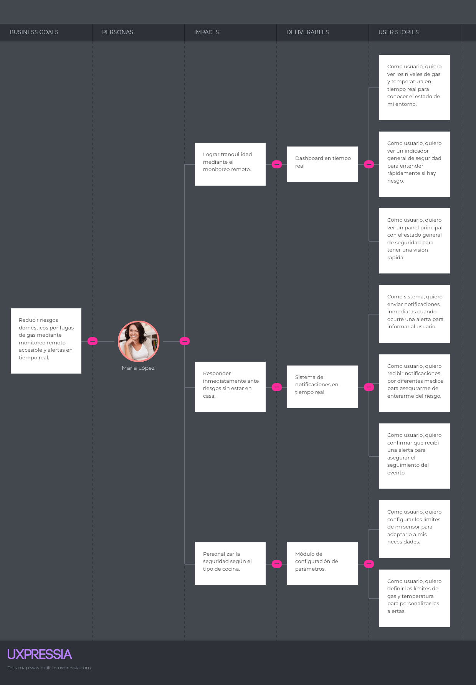

**Segmento Objetivo 2: Administradores y Chefs de Restaurantes**

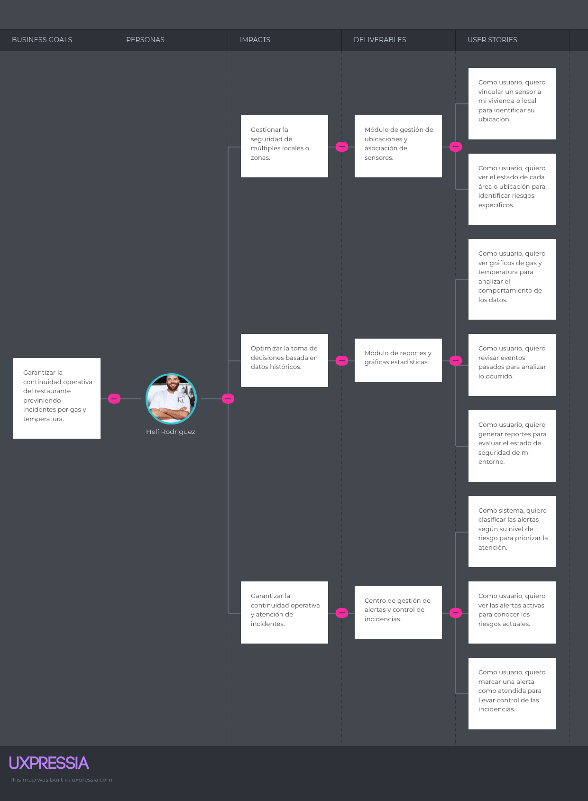

### 2.4.3. Product Backlog

En esta sección se presenta el Product Backlog de SmartGas, organizado según el valor que cada User Story aporta al negocio y a los usuarios. La priorización considera como elementos principales el monitoreo preventivo, la detección temprana de riesgos, las alertas inmediatas y la capacidad de respuesta ante incidentes en hogares y restaurantes.

| # Orden | User Story ID | Título | Story Points (1 / 2 / 3 / 5 / 8) | Sprint |
|---|---|---|---|---|
| 1 | US09 | Ver estado en tiempo real | 8 | Sprint 1 |
| 2 | US10 | Actualizar datos automáticamente | 8 | Sprint 1 |
| 3 | US12 | Detectar fuga de gas | 8 | Sprint 1 |
| 4 | US13 | Detectar temperatura anómala | 8 | Sprint 1 |
| 5 | US15 | Recibir notificación push | 8 | Sprint 1 |
| 6 | US11 | Ver estado general de seguridad | 5 | Sprint 1 |
| 7 | US16 | Visualizar alertas activas | 5 | Sprint 1 |
| 8 | US05 | Registrar sensor | 5 | Sprint 1 |
| 9 | US06 | Asociar sensor a zona | 5 | Sprint 1 |
| 10 | US14 | Generar evento de anomalía | 5 | Sprint 2 |
| 11 | US17 | Confirmar alerta recibida | 3 | Sprint 2 |
| 12 | US18 | Marcar alerta como atendida | 3 | Sprint 2 |
| 13 | US19 | Consultar historial | 5 | Sprint 2 |
| 14 | US20 | Filtrar historial por fecha | 3 | Sprint 2 |
| 15 | US21 | Generar reporte de seguridad | 5 | Sprint 2 |
| 16 | US22 | Configurar límites de seguridad | 5 | Sprint 2 |
| 17 | US23 | Configurar contactos de emergencia | 3 | Sprint 2 |
| 18 | US24 | Configurar preferencias de notificación | 3 | Sprint 2 |
| 19 | US25 | Guardar datos locales | 5 | Sprint 2 |
| 20 | US26 | Usar notificaciones del dispositivo | 5 | Sprint 2 |
| 21 | US27 | Usar cámara para registrar sensor | 5 | Sprint 3 |
| 22 | US08 | Ver sensores registrados | 3 | Sprint 3 |
| 23 | US07 | Configurar sensor | 5 | Sprint 3 |
| 24 | US01 | Registrarse en la app | 5 | Sprint 3 |
| 25 | US02 | Iniciar sesión | 5 | Sprint 3 |
| 26 | US03 | Gestionar perfil | 3 | Sprint 3 |
| 27 | US04 | Cerrar sesión | 1 | Sprint 3 |
| 28 | TS01 | API de autenticación | 5 | Sprint 1 |
| 29 | TS02 | API de sensores | 8 | Sprint 1 |
| 30 | TS03 | API de telemetría | 8 | Sprint 1 |
| 31 | TS04 | API de alertas | 5 | Sprint 2 |
| 32 | TS05 | Integración con servicio externo | 5 | Sprint 2 |
| 33 | SP01 | Investigar tecnología móvil nueva | 3 | Sprint 1 |

## 2.5. Strategic-Level Domain-Driven Design

Esta sección describe cómo se aplicó Domain-Driven Design a nivel estratégico para organizar SmartGas como una solución móvil orientada al monitoreo preventivo de riesgos por gas y temperatura. A partir de los hallazgos de las entrevistas, las user stories y el product backlog, se identificaron los procesos principales del dominio: registro de usuarios, gestión de sensores, monitoreo de lecturas, detección de incidentes, envío de alertas, consulta de historial y generación de reportes.

El objetivo de este análisis es separar las responsabilidades del sistema en bounded contexts claros, reduciendo el acoplamiento entre módulos y permitiendo que la aplicación móvil evolucione de forma ordenada. Para ello, se utilizaron técnicas como EventStorming, Candidate Context Discovery, Domain Message Flows Modeling, Bounded Context Canvases y Context Mapping.

### 2.5.1. EventStorming

El EventStorming permitió representar los eventos más importantes que ocurren dentro del sistema SmartGas. Esta dinámica ayudó a identificar qué hechos cambian el estado del negocio y cómo se relacionan con las necesidades de los usuarios entrevistados.

En el caso de SmartGas, los eventos principales se relacionan con el registro del usuario, la vinculación de sensores, la recepción de lecturas de gas y temperatura, la detección de anomalías, la generación de alertas y la consulta de información histórica desde la aplicación móvil.

#### 2.5.1.1. Candidate Context Discovery

En esta etapa se agruparon los eventos del dominio según su afinidad funcional. Esto permitió detectar los posibles bounded contexts del sistema y separar las responsabilidades de acuerdo con el valor que entregan al usuario.

  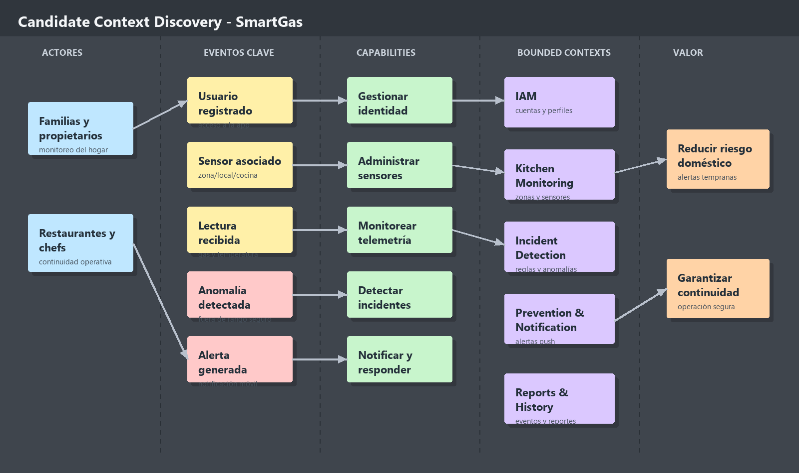

Los candidate contexts identificados para SmartGas son los siguientes:

| Candidate Context | Responsabilidad principal | Valor para el usuario |
|---|---|---|
| Identity & Access Management | Gestionar registro, inicio de sesión, cierre de sesión y perfil del usuario. | Permite acceder de forma segura a la aplicación móvil. |
| Kitchen Monitoring | Registrar sensores y recibir lecturas de gas, temperatura y estado del ambiente. | Permite visualizar la seguridad del hogar o negocio en tiempo real. |
| Incident Detection | Analizar lecturas y reconocer fugas, temperaturas anómalas o cambios peligrosos. | Reduce el tiempo de reacción ante situaciones de riesgo. |
| Incident Prevention & Notification | Generar alertas, notificaciones push y recomendaciones preventivas. | Informa al usuario inmediatamente desde su celular. |
| Reports & History | Almacenar eventos, historial de lecturas y reportes de seguridad. | Facilita revisar incidentes pasados y tomar mejores decisiones. |
| Configuration & Mobile Capabilities | Gestionar preferencias, umbrales, almacenamiento local y recursos del dispositivo. | Adapta la experiencia móvil a las necesidades del usuario. |
| External Integrations | Conectar el sistema con servicios externos necesarios para alertas o recomendaciones. | Enriquece la información entregada por la app. |

#### 2.5.1.2. Domain Message Flows Modeling

El modelado de flujos de mensajes permite representar cómo se comunican los contextos delimitados mediante eventos, comandos o consultas. En SmartGas, el flujo principal inicia cuando el usuario registra o configura un sensor desde la aplicación móvil. Luego, el sistema recibe lecturas de gas y temperatura, las analiza y, si detecta una anomalía, genera una alerta que se envía al usuario mediante una notificación push.

  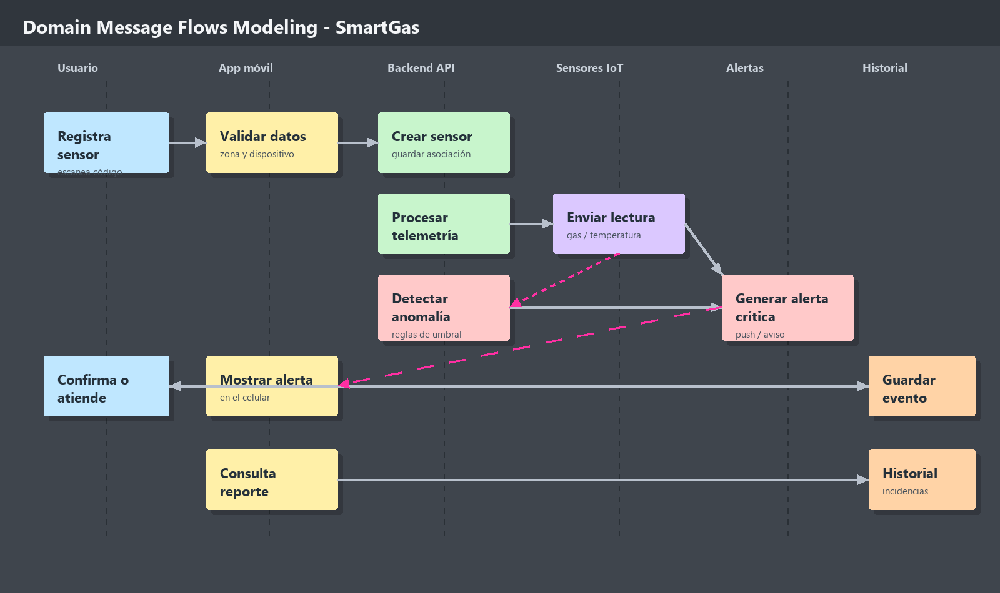

Flujo principal identificado:

| Paso | Origen | Mensaje o evento | Destino | Resultado |
|---|---|---|---|---|
| 1 | Usuario | Sensor registrado | Kitchen Monitoring | El sistema asocia el sensor al usuario. |
| 2 | Sensor | Lectura recibida | Kitchen Monitoring | Se almacena la lectura de gas y temperatura. |
| 3 | Kitchen Monitoring | Lectura actualizada | Incident Detection | Se evalúan umbrales y patrones de riesgo. |
| 4 | Incident Detection | Incidente detectado | Incident Prevention & Notification | Se crea una alerta con nivel de severidad. |
| 5 | Incident Prevention & Notification | Notificación enviada | Mobile App | El usuario recibe una alerta inmediata. |
| 6 | Usuario | Alerta atendida | Reports & History | Se registra la acción tomada por el usuario. |

#### 2.5.1.3. Bounded Context Canvases

Los Bounded Context Canvases permiten describir con mayor claridad el propósito, límites, lenguaje y responsabilidades de cada contexto. En SmartGas, estos contextos se organizaron tomando como base las necesidades principales detectadas en las entrevistas: monitorear riesgos, recibir alertas rápidas y revisar información histórica.

  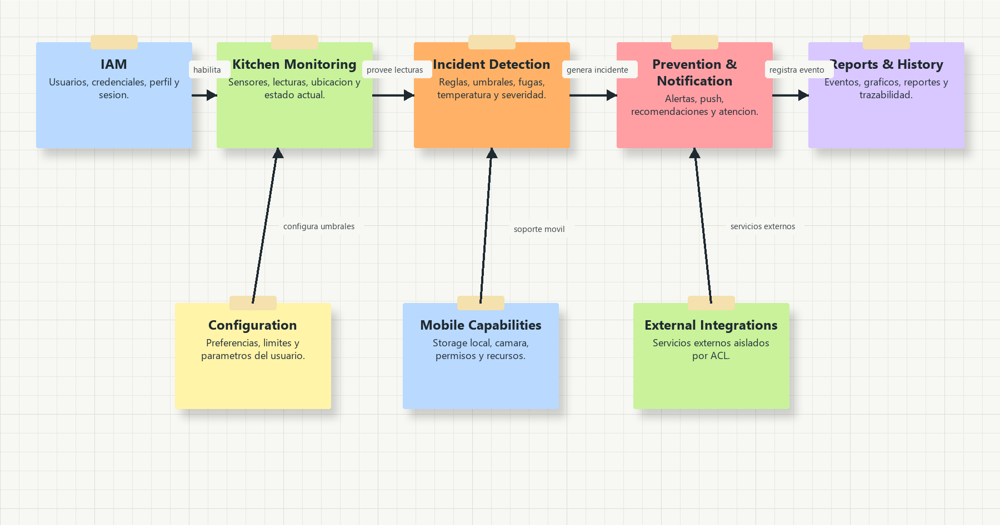

| Bounded Context | Descripción | Conceptos principales |
|---|---|---|
| Identity & Access Management | Controla la identidad del usuario y el acceso a la aplicación. | Usuario, credenciales, perfil, sesión. |
| Kitchen Monitoring | Administra sensores, ubicaciones y lecturas en tiempo real. | Sensor, lectura, gas, temperatura, ubicación. |
| Incident Detection | Evalúa datos recibidos para detectar riesgos. | Umbral, fuga, anomalía, severidad, incidente. |
| Incident Prevention & Notification | Gestiona alertas y comunicación preventiva. | Alerta, notificación push, recomendación, estado de atención. |
| Reports & History | Organiza información histórica para consulta y análisis. | Evento, historial, reporte, gráfico, tendencia. |
| Configuration & Mobile Capabilities | Gestiona preferencias y recursos propios del dispositivo móvil. | Preferencia, almacenamiento local, cámara, permiso, configuración. |
| External Integrations | Permite consumir servicios externos necesarios para complementar la solución. | API externa, servicio de notificaciones, integración. |

### 2.5.2. Context Mapping

El Context Mapping muestra cómo se relacionan los bounded contexts identificados. En SmartGas, los contextos no trabajan de forma aislada, ya que el monitoreo, la detección de incidentes y las alertas dependen del intercambio de información entre módulos.

  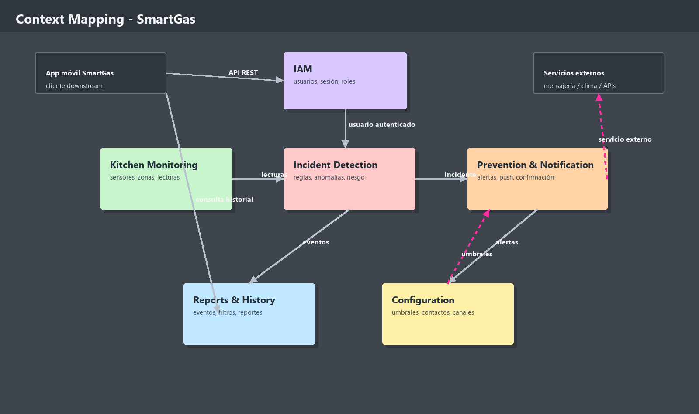

| Origen | Destino | Tipo de relación | Comentario |
|---|---|---|---|
| Identity & Access Management | Kitchen Monitoring | Customer/Supplier | El monitoreo requiere usuarios autenticados para asociar sensores y ubicaciones. |
| Kitchen Monitoring | Incident Detection | Customer/Supplier | La detección de incidentes consume lecturas generadas por los sensores registrados. |
| Incident Detection | Incident Prevention & Notification | Customer/Supplier | Las alertas se generan a partir de fugas, temperaturas anómalas o estados peligrosos. |
| Incident Prevention & Notification | Mobile App | Open Host Service | El contexto expone alertas y estados para que la aplicación móvil los muestre al usuario. |
| Kitchen Monitoring | Reports & History | Conformist | Los reportes consumen lecturas históricas sin modificar el modelo del monitoreo. |
| Incident Prevention & Notification | Reports & History | Conformist | El historial registra alertas emitidas y acciones realizadas por el usuario. |
| Configuration & Mobile Capabilities | Kitchen Monitoring | Shared Kernel | Las preferencias de umbrales y recursos móviles afectan la forma de registrar o visualizar sensores. |
| External Integrations | Incident Prevention & Notification | Anticorruption Layer | Las integraciones externas se aíslan para no contaminar el modelo principal del dominio. |

### 2.5.3. Software Architecture

La arquitectura de software de SmartGas está diseñada para soportar una aplicación móvil conectada a sensores inteligentes y servicios backend. La app permite a los usuarios monitorear lecturas en tiempo real, recibir alertas inmediatas, configurar sensores, revisar reportes y consultar el historial de incidentes.

La solución se apoya en una API REST que concentra la lógica principal del sistema, una base de datos para persistir usuarios, sensores y eventos, servicios de dominio para detección de incidentes y servicios externos para notificaciones o información complementaria. Esta separación permite mantener una arquitectura clara, escalable y alineada con los bounded contexts definidos.

#### 2.5.3.1. Software Architecture Context Level Diagrams

El diagrama de contexto muestra a SmartGas como un sistema central utilizado por propietarios de vivienda y responsables de negocios que necesitan monitorear ambientes con riesgo de fuga de gas. El sistema se comunica con sensores IoT, servicios de notificación y servicios externos que complementan el funcionamiento de la solución.

  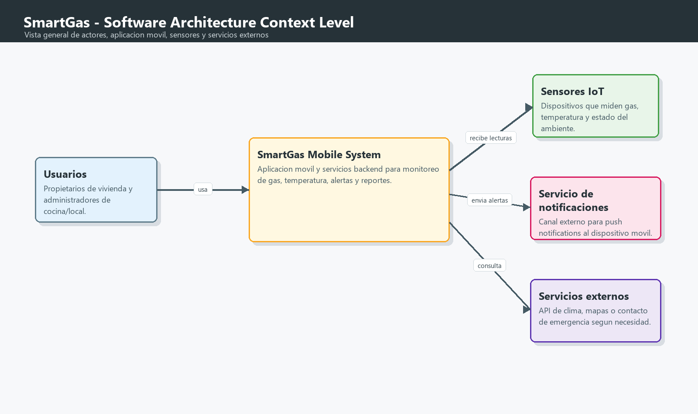

#### 2.5.3.2. Software Architecture Container Level Diagrams

En el nivel de contenedores se observa la organización tecnológica de SmartGas. La aplicación móvil se comunica con una REST API, la cual coordina los servicios de dominio, la base de datos, el gateway de sensores, el proveedor de notificaciones push y las APIs externas. Además, se considera almacenamiento local en el dispositivo móvil para mantener preferencias y últimas lecturas relevantes.

  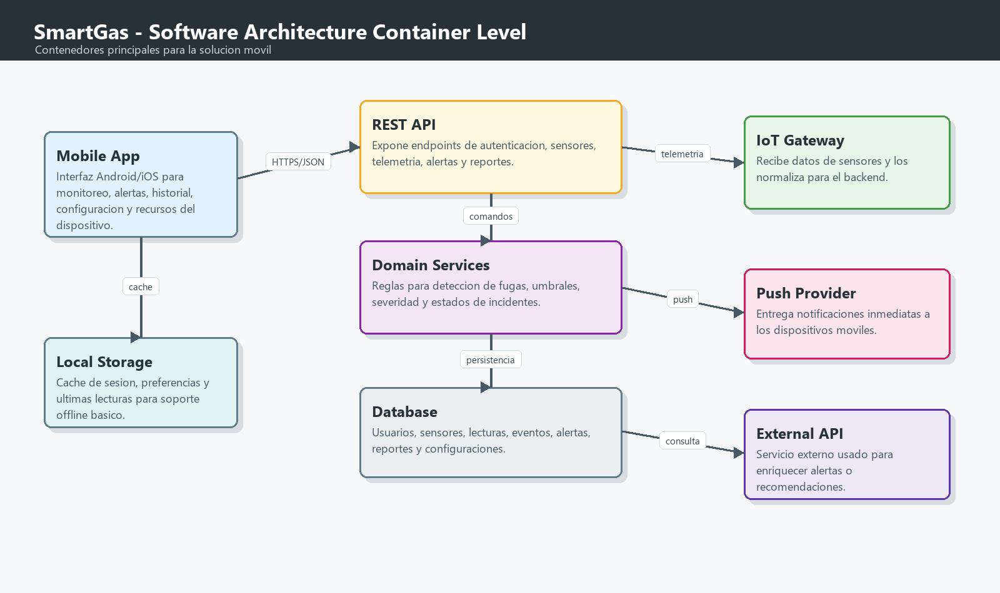

#### 2.5.3.3. Software Architecture Deployment Diagrams

El diagrama de despliegue representa la distribución física de SmartGas. La aplicación móvil se ejecuta en el dispositivo del usuario, los sensores se instalan en la cocina o zona de riesgo, el backend se despliega en la nube y la base de datos almacena la información persistente. También se incluyen servicios externos para notificaciones push y APIs complementarias.

  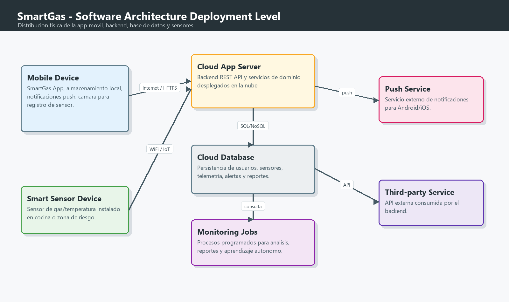

## 2.6. Tactical-Level Domain-Driven Design

En esta sección se presenta la propuesta táctica de diseño de la solución, con una sección interna por cada Bounded Context identificado en 2.5.

Ambos productos aplican una **arquitectura en capas por bounded context**:

- **Web Services (`SmartGas.Api`):** *Interface Layer* → `Controllers/`; *Application Layer* → `Services/`; *Domain Layer* → `Models/`; *Infrastructure Layer* → `Data/AppDbContext.cs`, `Migrations/` y servicios externos.
- **Web Application (`SmartGas-Frontend`):** cada bounded context replica la estructura `domain/model/` (entities), `application/` (stores), `infrastructure/` (services HTTP) y `presentation/pages|components/` (vistas), tal como se observa en `src/incident-detection/incidents/`.

**Diagrama de clases del Domain Layer (consolidado):**

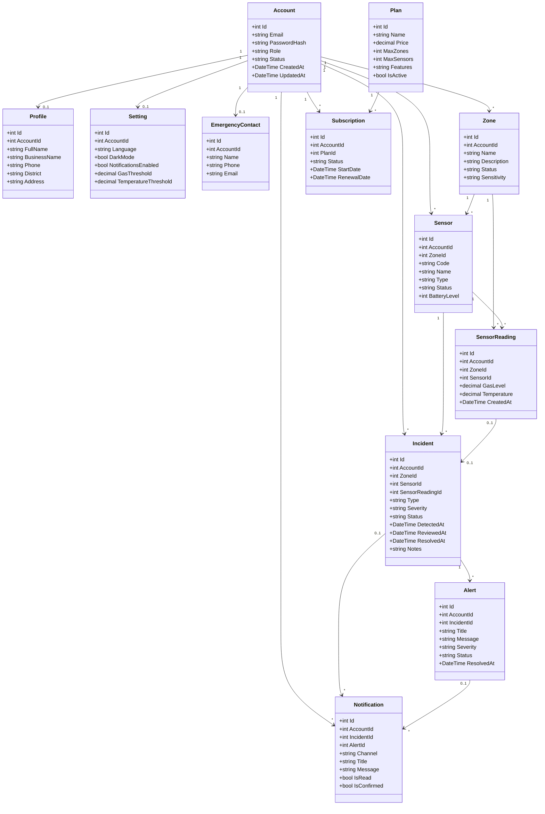
```mermaid
classDiagram
    class Account {
        +int Id
        +string Email
        +string PasswordHash
        +string Role
        +string Status
        +DateTime CreatedAt
        +DateTime UpdatedAt
    }
    class Profile {
        +int Id
        +int AccountId
        +string FullName
        +string BusinessName
        +string Phone
        +string District
        +string Address
    }
    class Setting {
        +int Id
        +int AccountId
        +string Language
        +bool DarkMode
        +bool NotificationsEnabled
        +decimal GasThreshold
        +decimal TemperatureThreshold
    }
    class EmergencyContact {
        +int Id
        +int AccountId
        +string Name
        +string Phone
        +string Email
    }
    class Zone {
        +int Id
        +int AccountId
        +string Name
        +string Description
        +string Status
        +string Sensitivity
    }
    class Sensor {
        +int Id
        +int AccountId
        +int ZoneId
        +string Code
        +string Name
        +string Type
        +string Status
        +int BatteryLevel
    }
    class SensorReading {
        +int Id
        +int AccountId
        +int ZoneId
        +int SensorId
        +decimal GasLevel
        +decimal Temperature
        +DateTime CreatedAt
    }
    class Incident {
        +int Id
        +int AccountId
        +int ZoneId
        +int SensorId
        +int SensorReadingId
        +string Type
        +string Severity
        +string Status
        +DateTime DetectedAt
        +DateTime ReviewedAt
        +DateTime ResolvedAt
        +string Notes
    }
    class Alert {
        +int Id
        +int AccountId
        +int IncidentId
        +string Title
        +string Message
        +string Severity
        +string Status
        +DateTime ResolvedAt
    }
    class Notification {
        +int Id
        +int AccountId
        +int IncidentId
        +int AlertId
        +string Channel
        +string Title
        +string Message
        +bool IsRead
        +bool IsConfirmed
    }
    class Plan {
        +int Id
        +string Name
        +decimal Price
        +int MaxZones
        +int MaxSensors
        +string Features
        +bool IsActive
    }
    class Subscription {
        +int Id
        +int AccountId
        +int PlanId
        +string Status
        +DateTime StartDate
        +DateTime RenewalDate
    }

    Account "1" --> "0..1" Profile
    Account "1" --> "0..1" Setting
    Account "1" --> "0..1" EmergencyContact
    Account "1" --> "*" Subscription
    Account "1" --> "*" Zone
    Account "1" --> "*" Sensor
    Account "1" --> "*" Incident
    Account "1" --> "*" Notification
    Plan "1" --> "*" Subscription
    Zone "1" --> "*" Sensor
    Zone "1" --> "*" SensorReading
    Sensor "1" --> "*" SensorReading
    Sensor "1" --> "*" Incident
    SensorReading "0..1" --> "0..1" Incident
    Incident "1" --> "*" Alert
    Incident "0..1" --> "*" Notification
    Alert "0..1" --> "*" Notification
```

### 2.6.1. Bounded Context: IAM (Identity and Access Management)

#### 2.6.1.1. Domain Layer
| Clase | Tipo DDD | Propósito |
| :--- | :--- | :--- |
| `Account` | Aggregate Root | Raíz de agregación del usuario: credenciales (`Email`, `PasswordHash`), `Role` (HomeOwner / RestaurantAdmin) y `Status`. Invariante: `Email` único. |
| `Profile` | Entity | Datos personales o del negocio: `FullName`, `BusinessName`, `Phone`, `District`, `Address`. Relación 1:1 con `Account`. |
| `Setting` | Entity | Preferencias e **invariantes de seguridad**: `GasThreshold`, `TemperatureThreshold`, `Language`, `DarkMode`, `NotificationsEnabled`. |
| `EmergencyContact` | Entity | Contacto al que escalar una emergencia. Invariante: único por cuenta (índice único sobre `AccountId`). |

#### 2.6.1.2. Interface Layer
| Controller | Endpoint | Acción |
| :--- | :--- | :--- |
| `AuthController` | `POST /api/v1/auth/sign-up` | Registro de cuenta |
| `AuthController` | `POST /api/v1/auth/sign-in` | Autenticación |
| `ProfilesController` | `GET` · `PATCH /api/v1/profiles/{accountId}` | Consulta y actualización de perfil |
| `SettingsController` | `GET` · `PATCH /api/v1/settings/{accountId}` | Consulta y actualización de umbrales y preferencias |
| `EmergencyContactsController` | `GET` · `PATCH /api/v1/emergency-contacts/{accountId}` | Gestión del contacto de emergencia |

En la Web Application, este contexto se expone mediante `src/iam/presentation/pages/` (`login-page`, `register-page`, `profile-page`, `settings-page`), y la sesión se conserva en el cliente mediante `SessionService` (clave `smartgas_session_v1` en `localStorage`), consumida por el guard `requiresAuth` del router.

#### 2.6.1.3. Application Layer
- `AuthService` — `SignUpAsync(SignUpRequest)`, `SignInAsync(SignInRequest)`: orquesta la creación de `Account` + `Profile` + `Setting` + suscripción inicial, y valida credenciales.
- `ProfileService` — `GetByAccountAsync(int)`, `UpdateAsync(int, UpdateProfileRequest)`.
- `SettingService` — `GetByAccountAsync(int)`, `UpdateAsync(int, UpdateSettingRequest)`.
- `EmergencyContactService` — `GetByAccountAsync(int)`, `UpdateAsync(...)`.

#### 2.6.1.4. Infrastructure Layer
- `AppDbContext` con `DbSet<Account>`, `DbSet<Profile>`, `DbSet<Setting>`, `DbSet<EmergencyContact>`; relaciones 1:1 con `DeleteBehavior.Cascade` e índice único sobre `Account.Email`.
- Proveedor **Npgsql (PostgreSQL)**; migraciones EF Core (`InitialCreate`, `AddEmergencyContact`).
- Localización de mensajes mediante archivos `.resx` por controller (`en-US` por defecto, `es-419`, `es-ES`).

#### 2.6.1.5. Bounded Context Software Architecture Component Level Diagrams
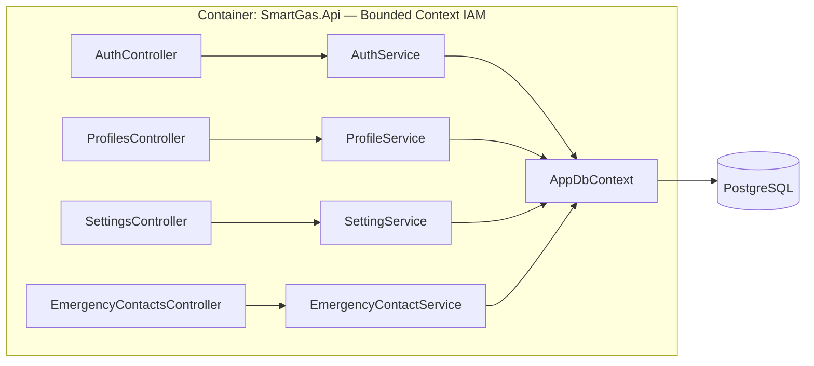
```mermaid
flowchart LR
    subgraph IAM["Container: SmartGas.Api — Bounded Context IAM"]
        AC["AuthController"]
        PC["ProfilesController"]
        SC["SettingsController"]
        EC["EmergencyContactsController"]
        AS["AuthService"]
        PS["ProfileService"]
        SS["SettingService"]
        ES["EmergencyContactService"]
        CTX["AppDbContext"]
    end
    DB[("PostgreSQL")]

    AC --> AS
    PC --> PS
    SC --> SS
    EC --> ES
    AS --> CTX
    PS --> CTX
    SS --> CTX
    ES --> CTX
    CTX --> DB
```

#### 2.6.1.6. Bounded Context Software Architecture Code Level Diagrams
##### 2.6.1.6.1. Bounded Context Domain Layer Class Diagrams
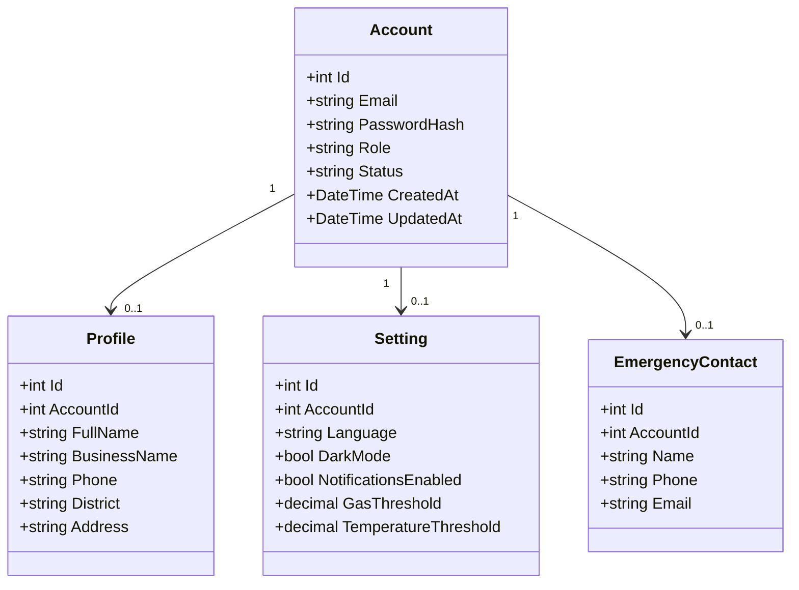
```mermaid
classDiagram
    class Account {
        +int Id
        +string Email
        +string PasswordHash
        +string Role
        +string Status
        +DateTime CreatedAt
        +DateTime UpdatedAt
    }
    class Profile {
        +int Id
        +int AccountId
        +string FullName
        +string BusinessName
        +string Phone
        +string District
        +string Address
    }
    class Setting {
        +int Id
        +int AccountId
        +string Language
        +bool DarkMode
        +bool NotificationsEnabled
        +decimal GasThreshold
        +decimal TemperatureThreshold
    }
    class EmergencyContact {
        +int Id
        +int AccountId
        +string Name
        +string Phone
        +string Email
    }
    Account "1" --> "0..1" Profile
    Account "1" --> "0..1" Setting
    Account "1" --> "0..1" EmergencyContact
```
##### 2.6.1.6.2. Bounded Context Database Design Diagram
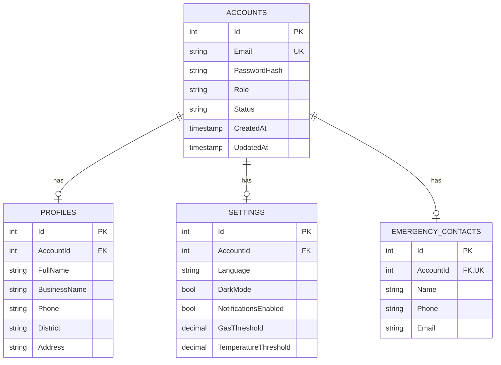
```mermaid
erDiagram
    ACCOUNTS ||--o| PROFILES : has
    ACCOUNTS ||--o| SETTINGS : has
    ACCOUNTS ||--o| EMERGENCY_CONTACTS : has
    ACCOUNTS {
        int Id PK
        string Email UK
        string PasswordHash
        string Role
        string Status
        timestamp CreatedAt
        timestamp UpdatedAt
    }
    PROFILES {
        int Id PK
        int AccountId FK
        string FullName
        string BusinessName
        string Phone
        string District
        string Address
    }
    SETTINGS {
        int Id PK
        int AccountId FK
        string Language
        bool DarkMode
        bool NotificationsEnabled
        decimal GasThreshold
        decimal TemperatureThreshold
    }
    EMERGENCY_CONTACTS {
        int Id PK
        int AccountId FK,UK
        string Name
        string Phone
        string Email
    }
```

### 2.6.2. Bounded Context: Kitchen Monitoring

#### 2.6.2.1. Domain Layer
| Clase | Tipo DDD | Propósito |
| :--- | :--- | :--- |
| `Zone` | Aggregate Root | Ambiente monitoreado (cocina, almacén, barra). Atributos `Status` (Safe / Warning / Critical) y `Sensitivity`. |
| `Sensor` | Entity | Dispositivo IoT asociado a una zona. `Code` único, `Type` (Gas, GasLP, CO, Smoke, MultiSensor), `Status` y `BatteryLevel`. |
| `SensorReading` | Entity de solo lectura | Lectura de telemetría con `GasLevel` y `Temperature` (ambos opcionales) y marca temporal; es inmutable una vez creada. |

**Reglas de dominio implementadas en este contexto** (`SensorReadingService`): normalización del tipo de sensor (`NormalizeSensorTypeForRules`), evaluación de umbrales (`GetIncidentType`), cálculo de severidad (`GetSeverity`) y actualización en cascada del estado de `Sensor` y `Zone`.

#### 2.6.2.2. Interface Layer
| Controller | Endpoint | Acción |
| :--- | :--- | :--- |
| `ZonesController` | `GET` · `POST /api/v1/zones` | Listar y crear zonas |
| `SensorsController` | `GET` · `POST /api/v1/sensors`, `PATCH /api/v1/sensors/{id}` | Listar, registrar y actualizar sensores |
| `SensorReadingsController` | `GET` · `POST /api/v1/sensor-readings` | Consultar telemetría y registrar nuevas lecturas |

En la Web Application corresponde a `src/kitchen-monitoring/monitoring/` y `src/kitchen-monitoring/devices/`, con las rutas `/app/monitoring` y `/app/devices`.

#### 2.6.2.3. Application Layer
- `ZoneService` — `GetByAccountAsync(int)`, `CreateAsync(CreateZoneRequest)` (valida límites de plan mediante `PlanLimitService`).
- `SensorService` — `GetByAccountAsync(int)`, `CreateAsync(CreateSensorRequest)`, `UpdateAsync(int, UpdateSensorRequest)`.
- `SensorReadingService` — `GetByAccountAsync(int)`, `CreateAsync(CreateSensorReadingRequest)`: **command handler principal del sistema**, ya que desencadena la creación de `Incident`, `Alert` y `Notification`.

#### 2.6.2.4. Infrastructure Layer
- `AppDbContext` con `DbSet<Zone>`, `DbSet<Sensor>`, `DbSet<SensorReading>`; índice único sobre `Sensor.Code`; eliminación en cascada desde `Account` y desde `Zone`.

#### 2.6.2.5. Bounded Context Software Architecture Component Level Diagrams
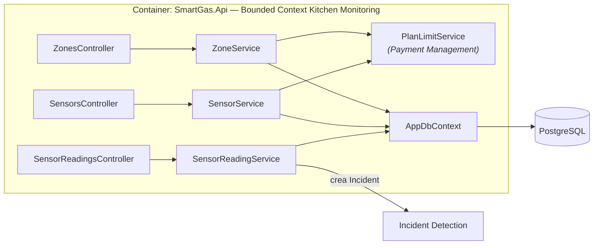
```mermaid
flowchart LR
    subgraph KM["Container: SmartGas.Api — Bounded Context Kitchen Monitoring"]
        ZC["ZonesController"]
        SC["SensorsController"]
        RC["SensorReadingsController"]
        ZS["ZoneService"]
        SS["SensorService"]
        RS["SensorReadingService"]
        PL["PlanLimitService<br/><i>(Payment Management)</i>"]
        CTX["AppDbContext"]
    end
    ID["Incident Detection"]
    DB[("PostgreSQL")]

    ZC --> ZS
    SC --> SS
    RC --> RS
    ZS --> PL
    SS --> PL
    ZS --> CTX
    SS --> CTX
    RS --> CTX
    RS -->|"crea Incident"| ID
    CTX --> DB
```

#### 2.6.2.6. Bounded Context Software Architecture Code Level Diagrams
##### 2.6.2.6.1. Bounded Context Domain Layer Class Diagrams
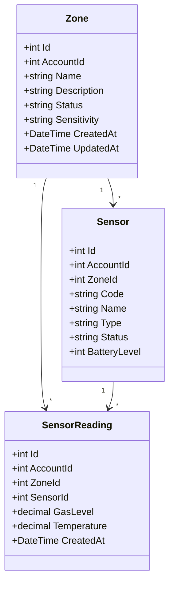
```mermaid
classDiagram
    class Zone {
        +int Id
        +int AccountId
        +string Name
        +string Description
        +string Status
        +string Sensitivity
        +DateTime CreatedAt
        +DateTime UpdatedAt
    }
    class Sensor {
        +int Id
        +int AccountId
        +int ZoneId
        +string Code
        +string Name
        +string Type
        +string Status
        +int BatteryLevel
    }
    class SensorReading {
        +int Id
        +int AccountId
        +int ZoneId
        +int SensorId
        +decimal GasLevel
        +decimal Temperature
        +DateTime CreatedAt
    }
    Zone "1" --> "*" Sensor
    Zone "1" --> "*" SensorReading
    Sensor "1" --> "*" SensorReading
```
##### 2.6.2.6.2. Bounded Context Database Design Diagram
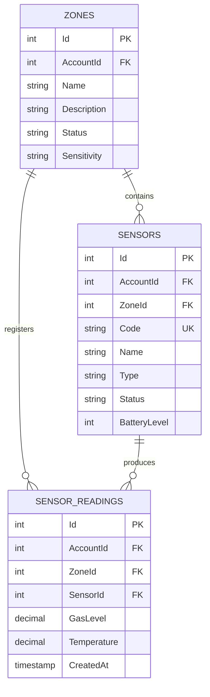
```mermaid
erDiagram
    ZONES ||--o{ SENSORS : contains
    ZONES ||--o{ SENSOR_READINGS : registers
    SENSORS ||--o{ SENSOR_READINGS : produces
    ZONES {
        int Id PK
        int AccountId FK
        string Name
        string Description
        string Status
        string Sensitivity
    }
    SENSORS {
        int Id PK
        int AccountId FK
        int ZoneId FK
        string Code UK
        string Name
        string Type
        string Status
        int BatteryLevel
    }
    SENSOR_READINGS {
        int Id PK
        int AccountId FK
        int ZoneId FK
        int SensorId FK
        decimal GasLevel
        decimal Temperature
        timestamp CreatedAt
    }
```

### 2.6.3. Bounded Context: Incident Detection

#### 2.6.3.1. Domain Layer
| Clase | Tipo DDD | Propósito |
| :--- | :--- | :--- |
| `Incident` | Aggregate Root | Riesgo detectado automáticamente. `Type`, `Severity` (High / Critical), `Status` (Active / Reviewed / Resolved / FalseAlarm), trazabilidad temporal (`DetectedAt`, `ReviewedAt`, `ResolvedAt`) y `Notes`. Referencia la `SensorReading` que lo originó. |

En la Web Application, la entidad correspondiente es `src/incident-detection/incidents/domain/model/incident.entity.js`.

#### 2.6.3.2. Interface Layer
| Controller | Endpoint | Acción |
| :--- | :--- | :--- |
| `IncidentsController` | `GET /api/v1/incidents` | Listar incidentes de la cuenta |
| `IncidentsController` | `PATCH /api/v1/incidents/{id}/review` | Marcar como revisado |
| `IncidentsController` | `PATCH /api/v1/incidents/{id}/resolve` | Resolver incidente |
| `IncidentsController` | `PATCH /api/v1/incidents/{id}/false-alarm` | Marcar como falsa alarma |

Cliente: `IncidentsPage` (`/app/incidents`), con `incident.store.js` como capa de aplicación e `incident.service.js` como infraestructura HTTP.

#### 2.6.3.3. Application Layer
- `IncidentService` — `GetByAccountAsync(int)`, `ReviewAsync(int)`, `ResolveAsync(int)`, `FalseAlarmAsync(int)`: command handlers de transición de estado del incidente.
- En el cliente, `incidentStore` expone `getIncidents`, `markReviewed`, `markResolved`, `markFalseAlarm` y `addNote`.

#### 2.6.3.4. Infrastructure Layer
- `AppDbContext` con `DbSet<Incident>`; relación `Incident → SensorReading` con `DeleteBehavior.SetNull` (eliminar una lectura no destruye el historial del incidente) y relaciones en cascada hacia `Account`, `Zone` y `Sensor`.

#### 2.6.3.5. Bounded Context Software Architecture Component Level Diagrams
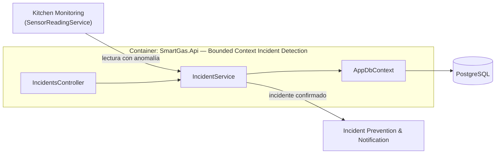
```mermaid
flowchart LR
    subgraph ID["Container: SmartGas.Api — Bounded Context Incident Detection"]
        IC["IncidentsController"]
        IS["IncidentService"]
        CTX["AppDbContext"]
    end
    KM["Kitchen Monitoring<br/>(SensorReadingService)"]
    IPN["Incident Prevention & Notification"]
    DB[("PostgreSQL")]

    KM -->|"lectura con anomalía"| IS
    IC --> IS
    IS --> CTX
    IS -->|"incidente confirmado"| IPN
    CTX --> DB
```

#### 2.6.3.6. Bounded Context Software Architecture Code Level Diagrams
##### 2.6.3.6.1. Bounded Context Domain Layer Class Diagrams
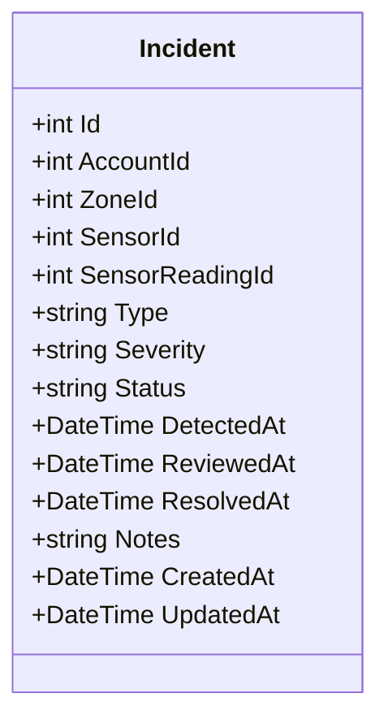
```mermaid
classDiagram
    class Incident {
        +int Id
        +int AccountId
        +int ZoneId
        +int SensorId
        +int SensorReadingId
        +string Type
        +string Severity
        +string Status
        +DateTime DetectedAt
        +DateTime ReviewedAt
        +DateTime ResolvedAt
        +string Notes
        +DateTime CreatedAt
        +DateTime UpdatedAt
    }
```
##### 2.6.3.6.2. Bounded Context Database Design Diagram
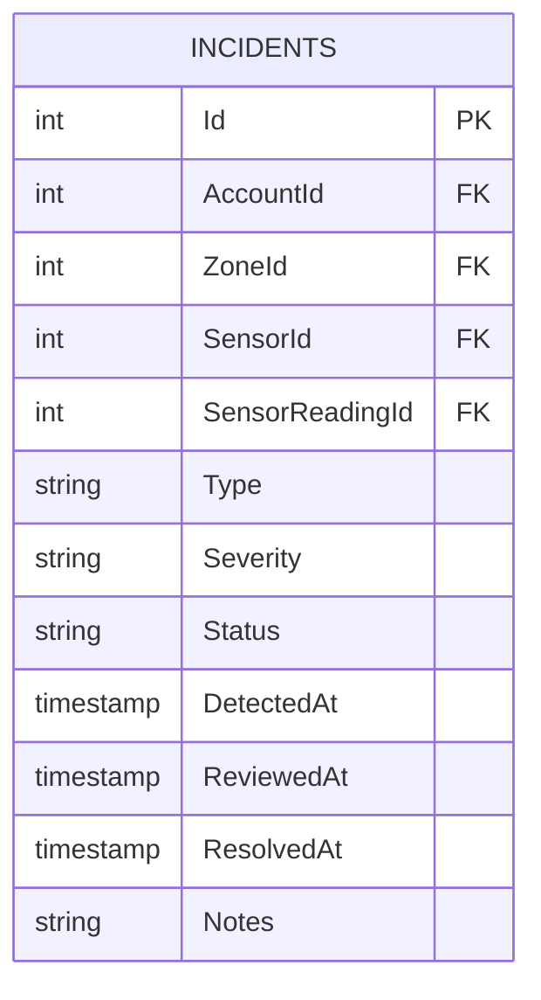
```mermaid
erDiagram
    INCIDENTS {
        int Id PK
        int AccountId FK
        int ZoneId FK
        int SensorId FK
        int SensorReadingId FK
        string Type
        string Severity
        string Status
        timestamp DetectedAt
        timestamp ReviewedAt
        timestamp ResolvedAt
        string Notes
    }
```

### 2.6.4. Bounded Context: Incident Prevention & Notification

#### 2.6.4.1. Domain Layer
| Clase | Tipo DDD | Propósito |
| :--- | :--- | :--- |
| `Alert` | Aggregate Root | Mensaje accionable derivado de un incidente: `Title`, `Message`, `Severity`, `Status` y `ResolvedAt`. |
| `Notification` | Entity | Entrega al usuario por un `Channel` (Web, Push, SMS, Email). Controla el ciclo de vida mediante `IsRead`/`ReadAt` e `IsConfirmed`/`ConfirmedAt`. Referencias opcionales a `Incident` y `Alert`. |

En la Web Application, ambas entidades están declaradas en `src/incident-prevention-notification/domain/model/`.

#### 2.6.4.2. Interface Layer
| Controller | Endpoint | Acción |
| :--- | :--- | :--- |
| `AlertsController` | `GET /api/v1/alerts` | Listar alertas de la cuenta |
| `NotificationsController` | `GET /api/v1/notifications` | Historial de notificaciones |
| `NotificationsController` | `PATCH /api/v1/notifications/{id}/read` | Marcar como leída |
| `NotificationsController` | `PATCH /api/v1/notifications/{id}/confirm` | Confirmar recepción (US-20) |

#### 2.6.4.3. Application Layer
- `AlertService` — `GetByAccountAsync(int)`.
- `NotificationService` — `GetByAccountAsync(int)`, `MarkAsReadAsync(int)`, `ConfirmAsync(int)`.

#### 2.6.4.4. Infrastructure Layer
- `AppDbContext` con `DbSet<Alert>` y `DbSet<Notification>`; `Alert → Incident` en cascada, y `Notification → Incident`/`Alert` con `DeleteBehavior.SetNull`.

#### 2.6.4.5. Bounded Context Software Architecture Component Level Diagrams
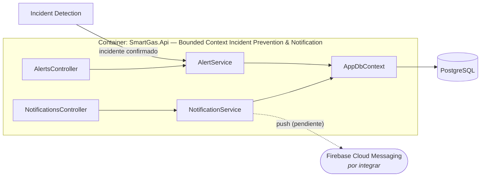
```mermaid
flowchart LR
    subgraph IPN["Container: SmartGas.Api — Bounded Context Incident Prevention & Notification"]
        AC["AlertsController"]
        NC["NotificationsController"]
        AS["AlertService"]
        NS["NotificationService"]
        CTX["AppDbContext"]
    end
    ID["Incident Detection"]
    FCM(["Firebase Cloud Messaging<br/><i>por integrar</i>"])
    DB[("PostgreSQL")]

    ID -->|"incidente confirmado"| AS
    AC --> AS
    NC --> NS
    AS --> CTX
    NS --> CTX
    NS -.->|"push (pendiente)"| FCM
    CTX --> DB
```

#### 2.6.4.6. Bounded Context Software Architecture Code Level Diagrams
##### 2.6.4.6.1. Bounded Context Domain Layer Class Diagrams
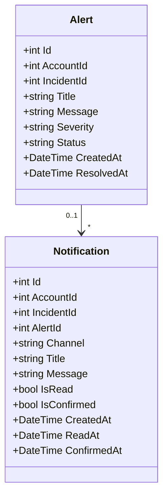
```mermaid
classDiagram
    class Alert {
        +int Id
        +int AccountId
        +int IncidentId
        +string Title
        +string Message
        +string Severity
        +string Status
        +DateTime CreatedAt
        +DateTime ResolvedAt
    }
    class Notification {
        +int Id
        +int AccountId
        +int IncidentId
        +int AlertId
        +string Channel
        +string Title
        +string Message
        +bool IsRead
        +bool IsConfirmed
        +DateTime CreatedAt
        +DateTime ReadAt
        +DateTime ConfirmedAt
    }
    Alert "0..1" --> "*" Notification
```
##### 2.6.4.6.2. Bounded Context Database Design Diagram
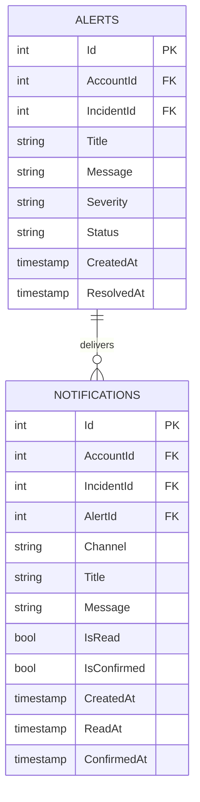
```mermaid
erDiagram
    ALERTS ||--o{ NOTIFICATIONS : delivers
    ALERTS {
        int Id PK
        int AccountId FK
        int IncidentId FK
        string Title
        string Message
        string Severity
        string Status
        timestamp CreatedAt
        timestamp ResolvedAt
    }
    NOTIFICATIONS {
        int Id PK
        int AccountId FK
        int IncidentId FK
        int AlertId FK
        string Channel
        string Title
        string Message
        bool IsRead
        bool IsConfirmed
        timestamp CreatedAt
        timestamp ReadAt
        timestamp ConfirmedAt
    }
```

### 2.6.5. Bounded Context: Post-Incident Procedures

#### 2.6.5.1. Domain Layer
| Clase | Tipo DDD | Propósito |
| :--- | :--- | :--- |
| `SecurityReport` | Read Model | Reporte de seguridad construido a partir del historial de incidentes, alertas y zonas de la cuenta. No posee persistencia propia. |

Implementado en la Web Application como `src/post-incident-procedures/reports/domain/model/security-report.entity.js`.

#### 2.6.5.2. Interface Layer
Ruta `/app/reports` (`ReportsPage`). Este contexto no expone controllers propios en los Web Services: compone la información consumiendo los endpoints `GET /api/v1/incidents`, `GET /api/v1/alerts` y `GET /api/v1/zones`.

#### 2.6.5.3. Application Layer
- `reportStore` (cliente) — orquesta la obtención y el filtrado de los datos del reporte.
- `ReportService.getReportData(accountId)` — ejecuta en paralelo las tres consultas y compone el resultado.

#### 2.6.5.4. Infrastructure Layer
- Cliente HTTP compartido `api-client.js` (axios) apuntando a `VITE_API_BASE_URL`.

#### 2.6.5.5. Bounded Context Software Architecture Component Level Diagrams
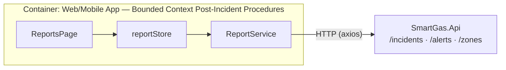
```mermaid
flowchart LR
    subgraph PIP["Container: Web/Mobile App — Bounded Context Post-Incident Procedures"]
        RP["ReportsPage"]
        RS["reportStore"]
        RSV["ReportService"]
    end
    API["SmartGas.Api<br/>/incidents · /alerts · /zones"]

    RP --> RS
    RS --> RSV
    RSV -->|"HTTP (axios)"| API
```

#### 2.6.5.6. Bounded Context Software Architecture Code Level Diagrams
##### 2.6.5.6.1. Bounded Context Domain Layer Class Diagrams
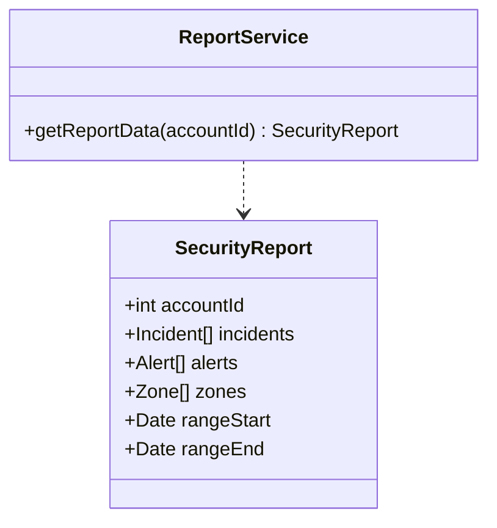
```mermaid
classDiagram
    class SecurityReport {
        +int accountId
        +Incident[] incidents
        +Alert[] alerts
        +Zone[] zones
        +Date rangeStart
        +Date rangeEnd
    }
    class ReportService {
        +getReportData(accountId) SecurityReport
    }
    ReportService ..> SecurityReport
```
##### 2.6.5.6.2. Bounded Context Database Design Diagram
Este contexto no posee tablas propias; consulta en modo lectura las tablas `INCIDENTS`, `ALERTS` y `ZONES` de los demás Bounded Contexts.

### 2.6.6. Bounded Context: Payment Management

#### 2.6.6.1. Domain Layer
| Clase | Tipo DDD | Propósito |
| :--- | :--- | :--- |
| `Plan` | Aggregate Root | Plan comercial con `Price`, `MaxZones`, `MaxSensors`, `Features` e `IsActive`. Planes vigentes: Basic (S/ 30), Professional (S/ 70), Corporate (S/ 100). |
| `Subscription` | Entity | Vínculo entre `Account` y `Plan`, con `Status`, `StartDate` y `RenewalDate`. |
| `PlanLimitValidationResult` | Value Object | Resultado de la validación de límites (`Success()` / `Fail(string)`). |

#### 2.6.6.2. Interface Layer
| Controller | Endpoint | Acción |
| :--- | :--- | :--- |
| `PlansController` | `GET /api/v1/plans` | Catálogo de planes |
| `SubscriptionsController` | `GET /api/v1/subscriptions/current/{accountId}` | Suscripción vigente |
| `SubscriptionsController` | `PATCH /api/v1/subscriptions/current/{accountId}/change-plan` | Cambio de plan |

Cliente: `SubscriptionPage` (`/app/subscription`), en `src/payment-management/subscriptions/`.

#### 2.6.6.3. Application Layer
- `PlanService` — `GetAllAsync()`, `GetCurrentSubscriptionAsync(int)`.
- `PlanLimitService` — `CanCreateZoneAsync(int)`, `CanCreateSensorAsync(int)`: **domain service** que hace cumplir los límites del plan sobre el contexto Kitchen Monitoring.

#### 2.6.6.4. Infrastructure Layer
- `AppDbContext` con `DbSet<Plan>` y `DbSet<Subscription>`; `Subscription → Plan` con `DeleteBehavior.Restrict` (no se elimina un plan con suscripciones activas).
- `DatabaseSeeder` precarga los tres planes comerciales.

#### 2.6.6.5. Bounded Context Software Architecture Component Level Diagrams
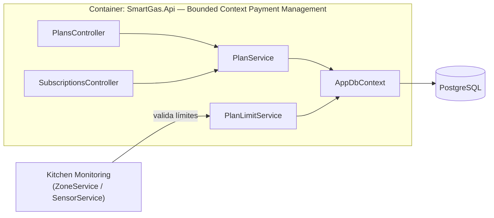
```mermaid
flowchart LR
    subgraph PAY["Container: SmartGas.Api — Bounded Context Payment Management"]
        PC["PlansController"]
        SC["SubscriptionsController"]
        PS["PlanService"]
        PL["PlanLimitService"]
        CTX["AppDbContext"]
    end
    KM["Kitchen Monitoring<br/>(ZoneService / SensorService)"]
    DB[("PostgreSQL")]

    PC --> PS
    SC --> PS
    KM -->|"valida límites"| PL
    PS --> CTX
    PL --> CTX
    CTX --> DB
```

#### 2.6.6.6. Bounded Context Software Architecture Code Level Diagrams
##### 2.6.6.6.1. Bounded Context Domain Layer Class Diagrams
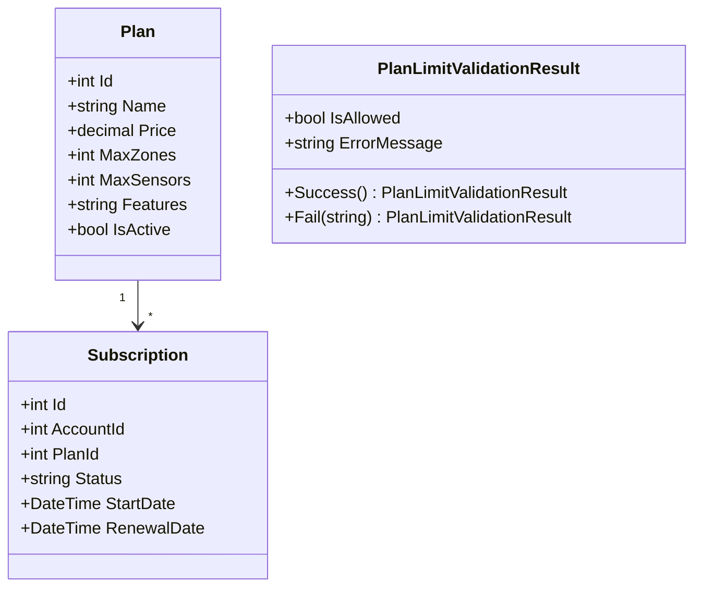
```mermaid
classDiagram
    class Plan {
        +int Id
        +string Name
        +decimal Price
        +int MaxZones
        +int MaxSensors
        +string Features
        +bool IsActive
    }
    class Subscription {
        +int Id
        +int AccountId
        +int PlanId
        +string Status
        +DateTime StartDate
        +DateTime RenewalDate
    }
    class PlanLimitValidationResult {
        +bool IsAllowed
        +string ErrorMessage
        +Success() PlanLimitValidationResult
        +Fail(string) PlanLimitValidationResult
    }
    Plan "1" --> "*" Subscription
```
##### 2.6.6.6.2. Bounded Context Database Design Diagram
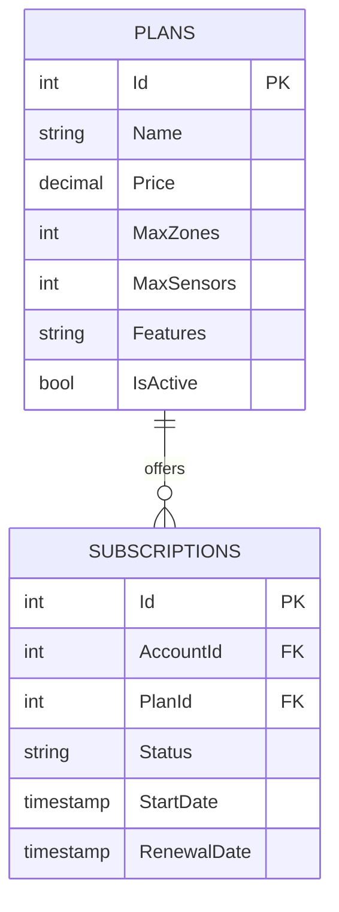
```mermaid
erDiagram
    PLANS ||--o{ SUBSCRIPTIONS : offers
    PLANS {
        int Id PK
        string Name
        decimal Price
        int MaxZones
        int MaxSensors
        string Features
        bool IsActive
    }
    SUBSCRIPTIONS {
        int Id PK
        int AccountId FK
        int PlanId FK
        string Status
        timestamp StartDate
        timestamp RenewalDate
    }
```

### 2.6.7. Bounded Context: Dashboard / Shared

#### 2.6.7.1. Domain Layer
Este contexto no posee entidades persistentes propias: opera como **read model** sobre los demás contexts y como capa de integración con servicios de terceros. Sus objetos de dominio son `DashboardSummaryResponse` (backend) / `dashboard-summary.entity.js` (cliente) y `ExternalWeatherResponse`.

#### 2.6.7.2. Interface Layer
| Controller | Endpoint | Acción |
| :--- | :--- | :--- |
| `DashboardController` | `GET /api/v1/dashboard/summary/{accountId}` | Resumen agregado del estado de seguridad |
| `ExternalWeatherController` | `GET /api/v1/external/weather/current` | Condiciones ambientales actuales |

Cliente: `DashboardPage` (`/app/dashboard`), además de los componentes compartidos `layout.component`, `toolbar-content.component`, `user-menu.component` y `language-switcher.component` (este último sustenta el requisito de internacionalización mediante `vue-i18n`).

#### 2.6.7.3. Application Layer
- `DashboardService` — `GetSummaryAsync(int)`: agrega datos de zonas, sensores, incidentes y notificaciones.
- `ExternalWeatherService` — `GetCurrentWeatherAsync(decimal latitude, decimal longitude)`: consume la API pública **Open-Meteo** y traduce la respuesta al DTO propio (Anti-Corruption Layer). En el cliente, `ExternalWeatherService.getCurrentWeather()` usa por defecto las coordenadas de Lima (-12.0464, -77.0428).

#### 2.6.7.4. Infrastructure Layer
- `HttpClient` inyectado mediante `AddHttpClient<ExternalWeatherService>()`, con `User-Agent` propio y parseo mediante `JsonDocument`.
- Endpoint consumido: `https://api.open-meteo.com/v1/forecast` con los parámetros `temperature_2m`, `relative_humidity_2m` y `wind_speed_10m`.

#### 2.6.7.5. Bounded Context Software Architecture Component Level Diagrams
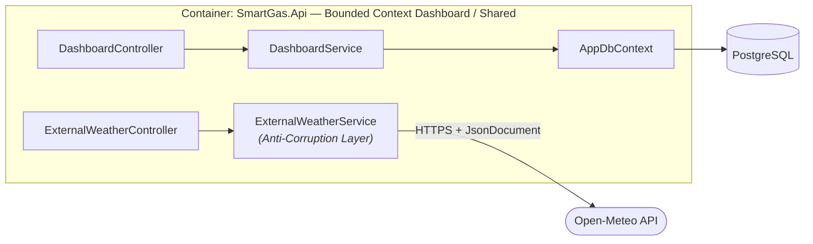
```mermaid
flowchart LR
    subgraph DASH["Container: SmartGas.Api — Bounded Context Dashboard / Shared"]
        DC["DashboardController"]
        WC["ExternalWeatherController"]
        DS["DashboardService"]
        WS["ExternalWeatherService<br/><i>(Anti-Corruption Layer)</i>"]
        CTX["AppDbContext"]
    end
    EXT(["Open-Meteo API"])
    DB[("PostgreSQL")]

    DC --> DS
    WC --> WS
    DS --> CTX
    WS -->|"HTTPS + JsonDocument"| EXT
    CTX --> DB
```

#### 2.6.7.6. Bounded Context Software Architecture Code Level Diagrams
##### 2.6.7.6.1. Bounded Context Domain Layer Class Diagrams
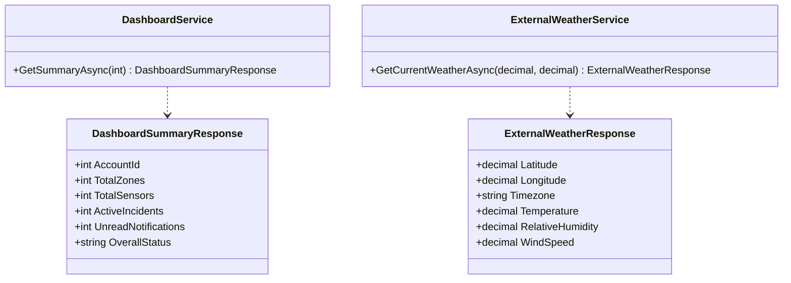
```mermaid
classDiagram
    class DashboardSummaryResponse {
        +int AccountId
        +int TotalZones
        +int TotalSensors
        +int ActiveIncidents
        +int UnreadNotifications
        +string OverallStatus
    }
    class ExternalWeatherResponse {
        +decimal Latitude
        +decimal Longitude
        +string Timezone
        +decimal Temperature
        +decimal RelativeHumidity
        +decimal WindSpeed
    }
    class DashboardService {
        +GetSummaryAsync(int) DashboardSummaryResponse
    }
    class ExternalWeatherService {
        +GetCurrentWeatherAsync(decimal, decimal) ExternalWeatherResponse
    }
    DashboardService ..> DashboardSummaryResponse
    ExternalWeatherService ..> ExternalWeatherResponse
```
##### 2.6.7.6.2. Bounded Context Database Design Diagram
Este contexto no posee tablas propias; consulta en modo lectura las tablas `ZONES`, `SENSORS`, `INCIDENTS` y `NOTIFICATIONS` de los demás Bounded Contexts.

**Diagrama de base de datos consolidado (PostgreSQL):**

```mermaid
erDiagram
    ACCOUNTS ||--o| PROFILES : has
    ACCOUNTS ||--o| SETTINGS : has
    ACCOUNTS ||--o| EMERGENCY_CONTACTS : has
    ACCOUNTS ||--o{ SUBSCRIPTIONS : owns
    ACCOUNTS ||--o{ ZONES : owns
    ACCOUNTS ||--o{ SENSORS : owns
    ACCOUNTS ||--o{ INCIDENTS : owns
    ACCOUNTS ||--o{ NOTIFICATIONS : receives
    PLANS ||--o{ SUBSCRIPTIONS : offers
    ZONES ||--o{ SENSORS : contains
    ZONES ||--o{ SENSOR_READINGS : registers
    SENSORS ||--o{ SENSOR_READINGS : produces
    SENSORS ||--o{ INCIDENTS : triggers
    ZONES ||--o{ INCIDENTS : locates
    SENSOR_READINGS ||--o| INCIDENTS : originates
    INCIDENTS ||--o{ ALERTS : raises
    INCIDENTS ||--o{ NOTIFICATIONS : notifies
    ALERTS ||--o{ NOTIFICATIONS : delivers
```

